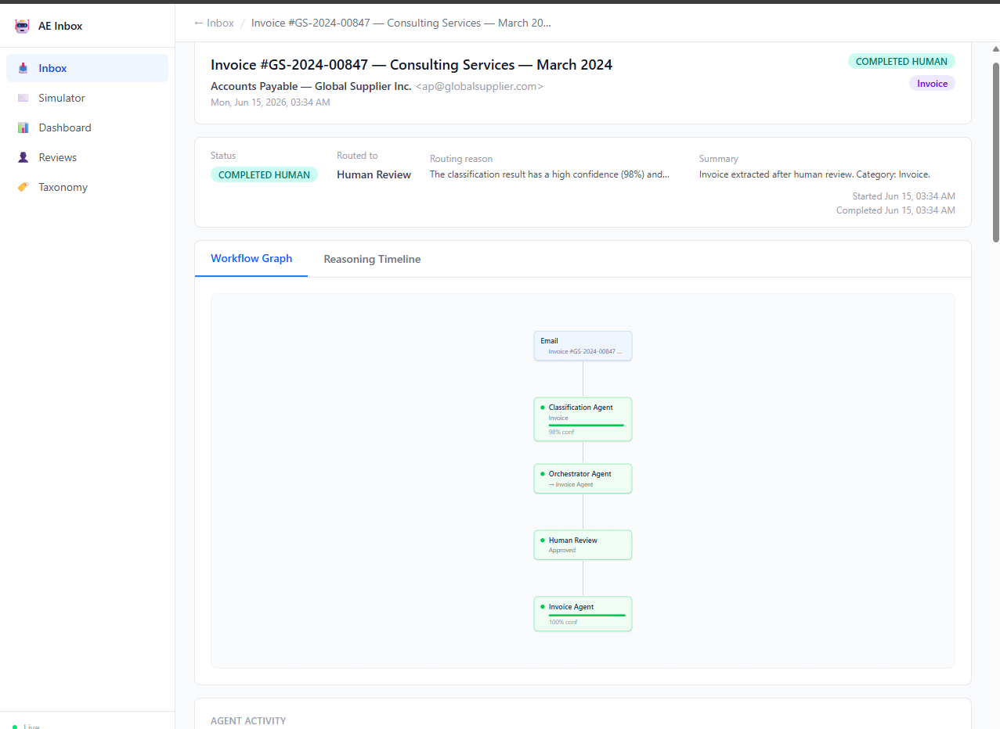
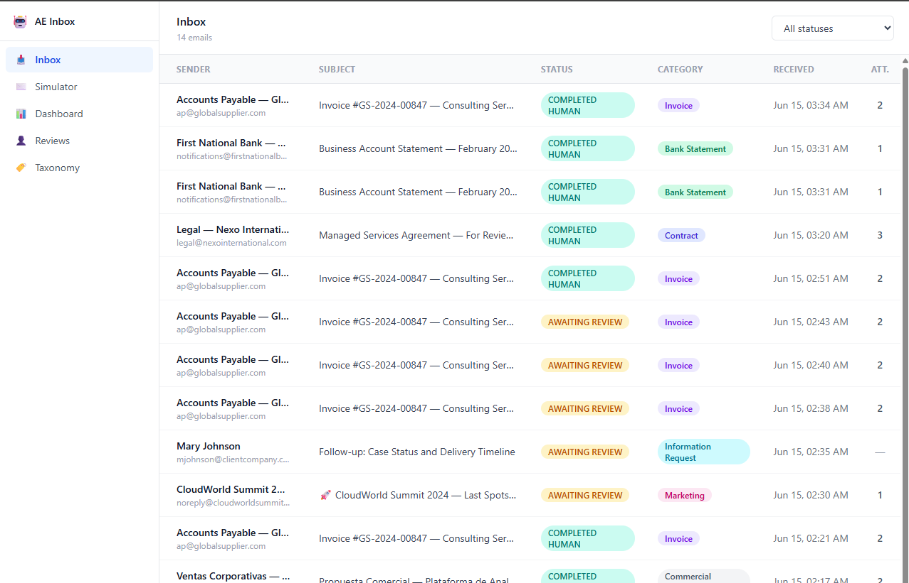
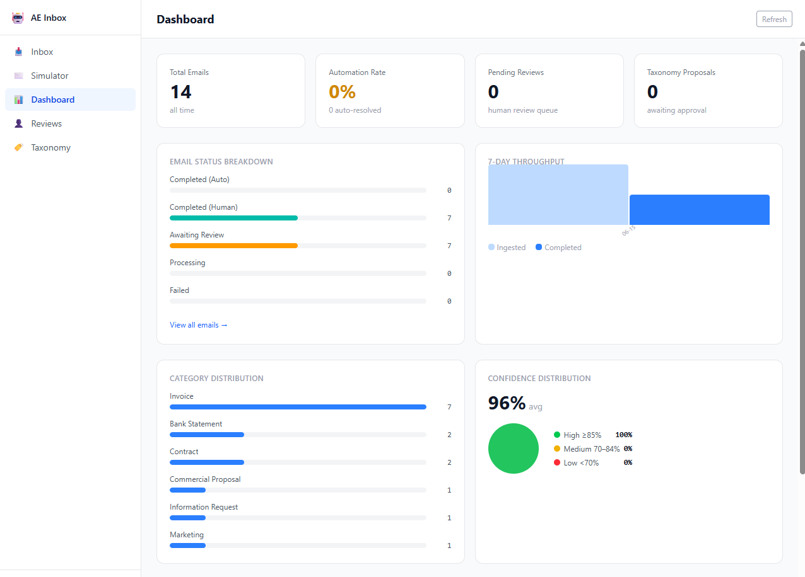
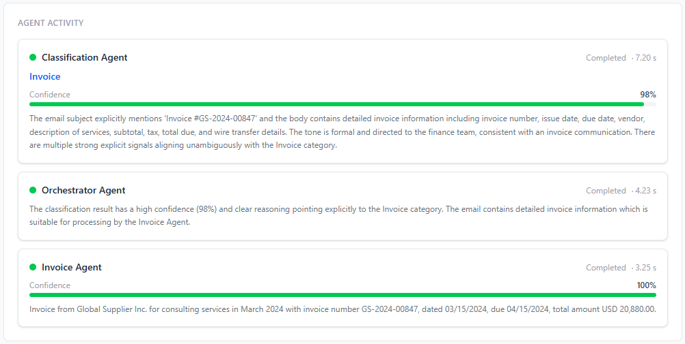
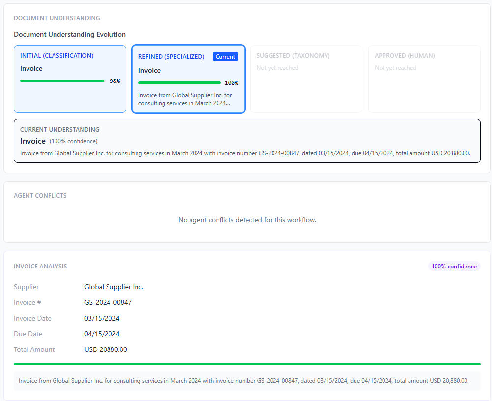
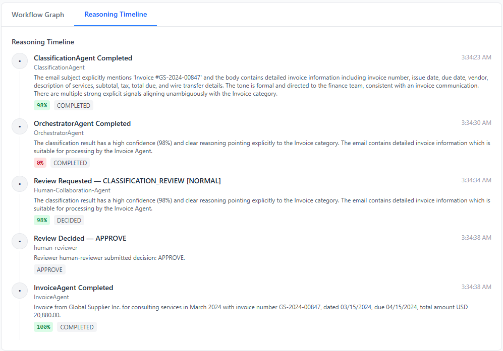
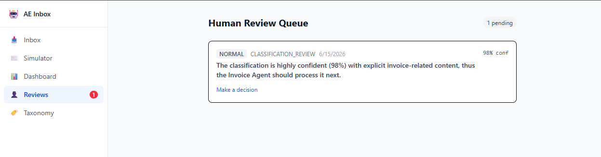

<div align="center">

# 🤖 Agentic Enterprise Inbox

### An AI agent workforce that reads your emails, reasons about them, and acts — so your team doesn't have to.

**Microsoft Agents League · Reasoning Agents Challenge**

[▶️ Watch Demo](https://youtu.be/nckqYqfNBtM) · [📖 User Guide](docs/user-guide.md) · [⚙️ Configuration](docs/configuration.md) · [📐 Architecture](docs/sad/00-sad-index.md) · [📋 Product Docs](docs/00-index.md)

</div>

---



> A real email processed end-to-end: the Classification Agent identified it as an Invoice at **98% confidence**, the Orchestrator routed it through Human Review, and the Invoice Agent extracted all structured data at **100% confidence** — automatically.

---

## The Problem

Organizations receive hundreds of business emails every day — invoices, contracts, bank statements, proposals, compliance documents.

Most still depend on people to read each one, decide what it is, extract the relevant data, and kick off the right business process. That is slow, error-prone, and impossible to scale.

**Static rules and single-model classifiers don't work.** Business language is ambiguous. New document types appear. Edge cases accumulate.

---

## The Solution

Agentic Enterprise Inbox replaces manual email triage with a **collaborative AI agent workforce**.

Every incoming email triggers a multi-agent reasoning pipeline:

```
Incoming Email
      │
      ▼
Classification Agent ──── understands business intent (Invoice, Contract, etc.)
      │
      ▼
Orchestrator Agent ──────── selects the right specialist and explains why
      │
   ┌──┴──────────────┐
   ▼                 ▼
Invoice Agent    Contract Agent ───── extracts structured data with confidence scores
                     │
                     ▼
           Taxonomy Evolution Agent ── proposes new categories when patterns emerge
                     │
                     ▼
           Human Collaboration Agent ─ escalates only what requires human judgment
                     │
                     ▼
              Business Action
```

The result: **autonomous, explainable, human-supervised processing** — at any scale.

---

## What Makes This Different

| Capability | How it works |
|-----------|-------------|
| **Multi-agent reasoning** | 7 specialized agents collaborate, challenge each other, and reach consensus |
| **Explainable decisions** | Every classification includes the agent's full reasoning chain and confidence score |
| **Self-evolving taxonomy** | The system proposes new business categories when it detects emerging patterns |
| **Human-in-the-loop** | Humans are involved only when confidence is low or agents disagree — never for routine work |
| **Live visual workflow** | Every email shows a real-time graph of exactly which agents ran and what they concluded |
| **Organizational learning** | Each decision makes the next one smarter |

---

## Live Screenshots

<table>
<tr>
<td width="50%">

**Inbox — all emails and their real-time status**



</td>
<td width="50%">

**Dashboard — operations at a glance**



</td>
</tr>
<tr>
<td width="50%">

**Agent Activity — what each agent did and how fast**



</td>
<td width="50%">

**Document Understanding — knowledge evolution across pipeline phases**



</td>
</tr>
<tr>
<td width="50%">

**Reasoning Timeline — full audit trail of every agent decision**



</td>
<td width="50%">

**Human Review Queue — only what actually needs a human**



</td>
</tr>
</table>

---

## Real Example

An invoice email arrives from Global Supplier Inc.

| Step | Agent | Output |
|------|-------|--------|
| 1 | Classification Agent | Category: **Invoice** · Confidence: **98%** |
| 2 | Orchestrator Agent | Route to: **Invoice Agent** · Reason: explicit invoice signals, high confidence |
| 3 | Human Collaboration Agent | Escalated for confirmation (configured threshold) |
| 4 | Human reviewer | **Approved** in 4 seconds |
| 5 | Invoice Agent | Supplier: Global Supplier Inc. · Invoice #GS-2024-00847 · Amount: **USD 20,880.00** · Due: 04/15/2024 · Confidence: **100%** |

Total elapsed time: **~15 seconds** from email arrival to structured business data — including the human review step.

---

## Hackathon Criteria Alignment

| Criterion | How we address it |
|-----------|------------------|
| **Multi-agent collaboration** | 7 specialized agents with defined roles, communication protocols, and conflict resolution |
| **Reasoning transparency** | Full reasoning chain + confidence score on every decision, visible in the UI |
| **Human-in-the-loop** | Explicit escalation with structured review UI; humans control thresholds |
| **Dynamic learning** | Taxonomy Evolution Agent learns from human corrections and proposes new categories |
| **Orchestration** | Orchestrator Agent manages state, routing decisions, and agent lifecycle |

---

## Agent Workforce

| Agent | Role |
|-------|------|
| **Orchestrator Agent** | Coordinates the pipeline; selects and sequences specialized agents |
| **Classification Agent** | Identifies the business type of every incoming email |
| **Invoice Agent** | Extracts supplier, invoice number, amounts, dates, taxes |
| **Contract Agent** | Extracts parties, dates, obligations, renewal clauses, risk flags |
| **Taxonomy Evolution Agent** | Detects emerging patterns and proposes new email categories |
| **Human Collaboration Agent** | Decides when and how to involve a human reviewer |
| **Human Reviewer** | Approves, corrects, or rejects agent decisions when called upon |

---

## Technology Stack

| Layer | Technology |
|-------|-----------|
| AI Agents | Azure AI Foundry Prompt Agents (gpt-4.1-mini) |
| Backend | .NET 10 · Clean Architecture · SignalR |
| Data | SQLite · Entity Framework Core 9 |
| Frontend | React 19 · TanStack Query · ReactFlow |
| Auth (local) | Azure DefaultAzureCredential (`az login`) |
| Auth (prod) | Managed Identity + Azure Key Vault |
| Dev tooling | GitHub Copilot |

---

## Getting Started

### Prerequisites

- .NET 10 SDK
- Node.js 20+
- Azure AI Foundry project with agents deployed
- `az login` (uses DefaultAzureCredential — no API key stored locally)

### 1. Configure the API

Copy the template and fill in your Azure AI Foundry endpoint and agent IDs:

```bash
cp src/JF.AgenticEnterprise.Api/appsettings.Development.json.example \
   src/JF.AgenticEnterprise.Api/appsettings.Development.json
# Edit the file — it is gitignored, never committed
```

See **[docs/configuration.md](docs/configuration.md)** for all keys, defaults, and production secrets setup with Azure Key Vault.

### 2. Run the backend

```bash
cd src/JF.AgenticEnterprise.Api
dotnet run
# API starts at https://localhost:5001
```

### 3. Run the frontend

```bash
cd frontend/inbox-ui
npm install
npm run dev
# UI starts at http://localhost:5173
```

### 4. Send your first email

Open the **Simulator** tab, click **Invoice**, then **Send to Inbox →**. Watch the Workflow Graph animate as each agent processes the email in real time.

---

## Documentation

| Document | Description |
|----------|-------------|
| [User Guide](docs/user-guide.md) | Full walkthrough of every screen with screenshots |
| [Configuration](docs/configuration.md) | All config keys, local setup, and production secrets management |
| [System Architecture](docs/sad/00-sad-index.md) | Software Architecture Document |

---

<div align="center">

Built for the **Microsoft Agents League — Reasoning Agents Challenge**

</div>
