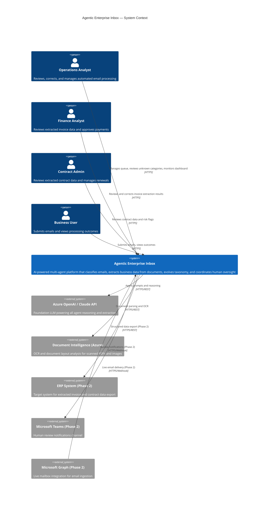
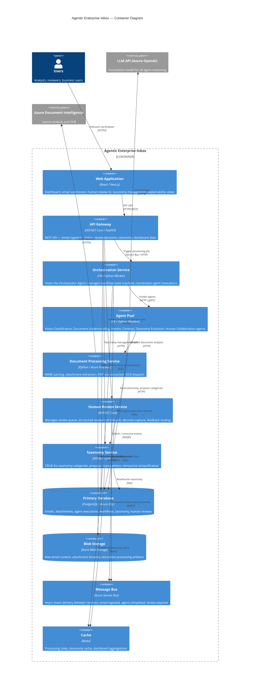
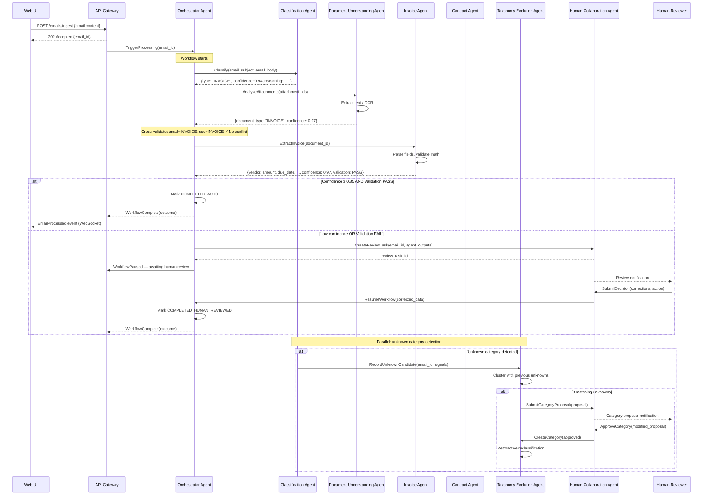
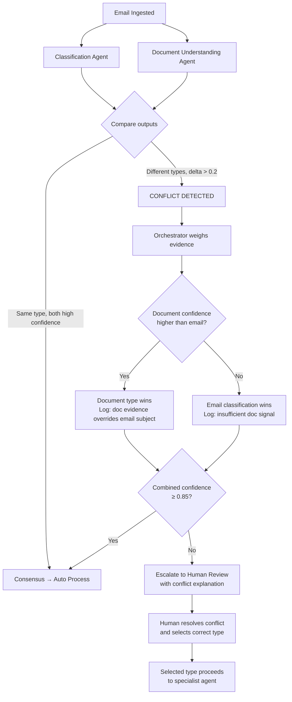
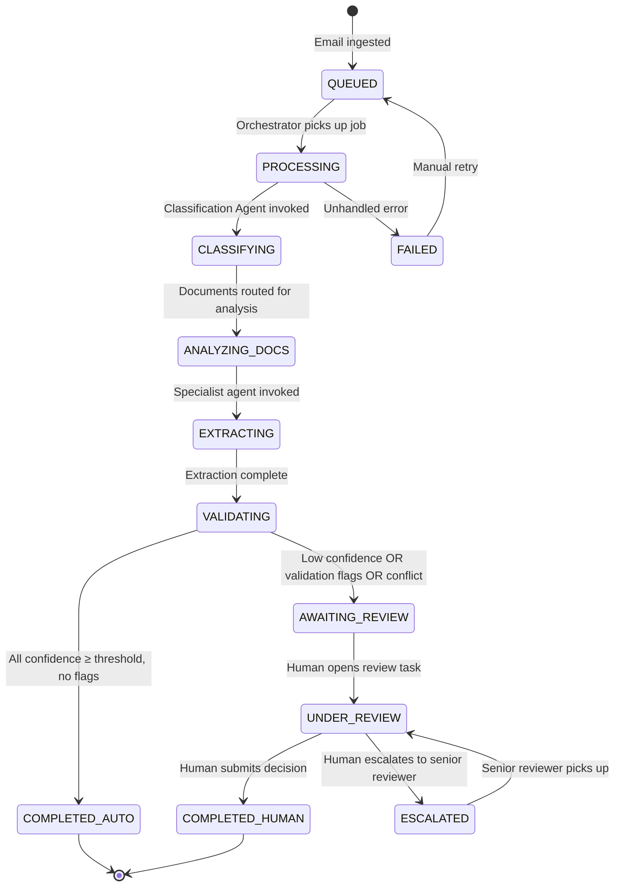
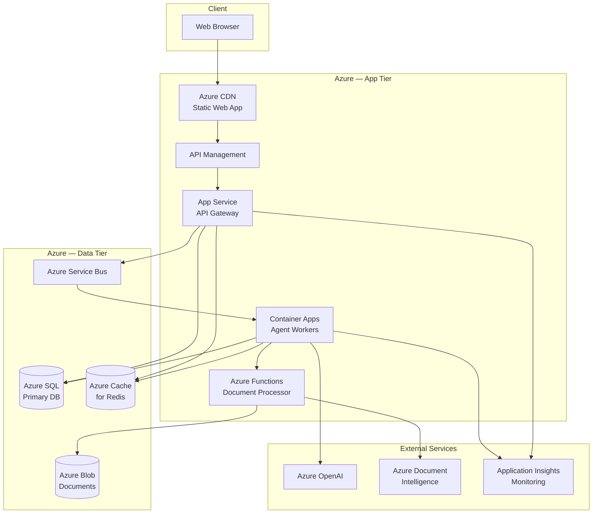

# Section 09 — System Architecture

---

## Context Diagram (C4 Level 1)

---

## Container Diagram (C4 Level 2)

---

## Agent Interaction Diagram

---

## Conflict Resolution Detail

---

## Processing State Machine

---

## Infrastructure Deployment

