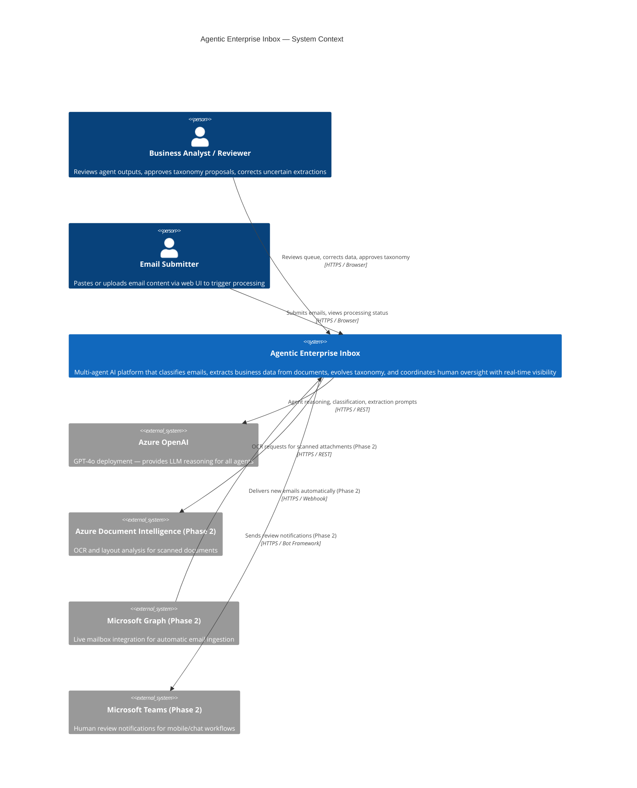
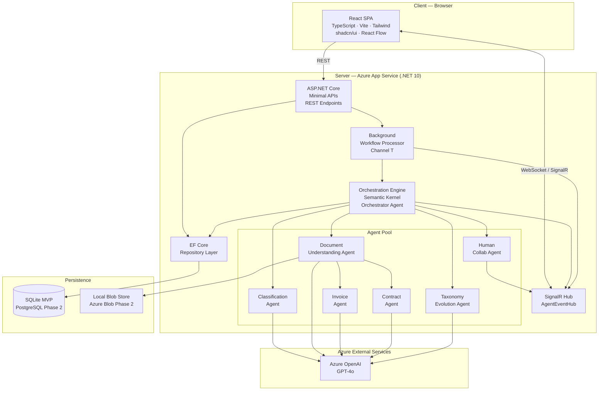
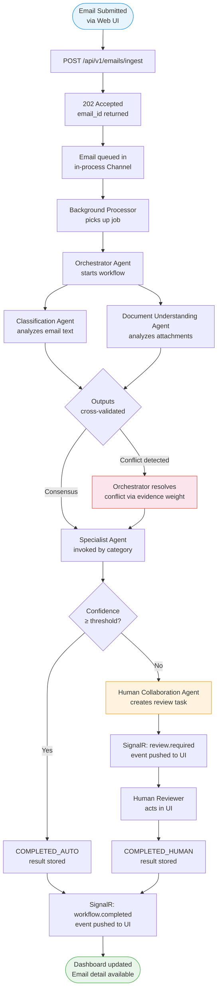

# Section 04 — Solution Overview

---

## Context Diagram

The context diagram shows the Agentic Enterprise Inbox system in relation to its users and external dependencies.

---

## System Overview Diagram

The overview shows the major system components and how they interact at the deployment level.

---

## Processing Flow Overview

The following diagram illustrates the high-level processing flow for a single email from ingestion to outcome.

---

## Key Architectural Patterns

| Pattern | Where Used | Why |
|---------|-----------|-----|
| Mediator (via Orchestrator) | Agent coordination | Decouples agents; enables conflict detection |
| Strategy | Agent selection by taxonomy type | Open/closed principle — new agents add, don't modify |
| Repository | Data access abstraction | Enables SQLite → PostgreSQL migration transparently |
| Domain Events | Agent execution → SignalR | Decouples agent logic from UI update mechanism |
| CQRS (lightweight) | Read queries vs. command processing | Dashboard reads optimized separately from processing writes |
| Chain of Responsibility | Agent execution sequence | Each agent receives previous context; builds on prior outputs |
| Observer | SignalR hub subscriptions | Multiple clients observe the same workflow progression |
