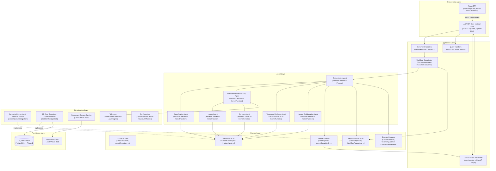

# Section 05 — Logical Architecture

---

## Layer Model

The system is organized into seven logical layers following Clean Architecture principles. Dependencies are strictly unidirectional: outer layers depend on inner layers; inner layers have no knowledge of outer layers.

---

## Frontend Layer

**Technology:** TypeScript, React 18, Vite, Tailwind CSS, shadcn/ui, React Flow, React Query, Zustand

### Responsibilities
- Present the email submission interface
- Display the real-time agent execution graph (React Flow)
- Render human review queue and structured review UI
- Show classification results, extraction summaries, confidence indicators
- Display taxonomy proposals and category management
- Subscribe to SignalR hub and update UI state in response to agent events

### Key Design Decisions
- **Vite** provides fast HMR during development and optimized production builds
- **React Flow** renders the agent collaboration graph as a live directed graph with animated edges
- **shadcn/ui** provides accessible, Tailwind-based UI components with minimal configuration
- **React Query** manages server state (email lists, review queue, taxonomy) with automatic caching and refetch
- **Zustand** manages ephemeral UI state (active workflow, real-time agent events) that doesn't need server persistence
- SignalR client connection is managed in a React context provider, shared across the application

---

## API Layer

**Technology:** ASP.NET Core Minimal APIs (.NET 10), SignalR

### Responsibilities
- Expose REST endpoints for email ingestion, status queries, review decisions, taxonomy management
- Host the SignalR `AgentEventHub` for real-time event streaming
- Map incoming requests to Application layer commands and queries
- Apply request validation, error mapping, and response shaping
- Serve OpenAPI (Swagger) documentation

### Key Design Decisions
- **Minimal APIs** preferred over MVC Controllers: less ceremony, better performance, sufficient for the API surface
- **SignalR Hub** runs in the same process as the API — no separate WebSocket server needed for MVP
- **Endpoint groups** organize endpoints by domain: `/emails`, `/reviews`, `/taxonomy`, `/dashboard`
- **Problem Details (RFC 7807)** for all error responses — consistent, client-parseable error format

---

## Application Layer

**Technology:** C# / .NET 10, no external framework dependency

### Responsibilities
- Coordinate command execution (email ingestion, review decisions, taxonomy approval)
- Handle read queries for dashboard and history views
- Bridge domain events to the SignalR hub
- Define the workflow coordination logic that the Orchestrator Agent implements

### Key Design Decisions
- Application layer has **no dependency on Semantic Kernel or Azure SDKs** — it works through interfaces
- Command/query separation (CQRS-lite) without a full CQRS framework — direct handler registration is sufficient for MVP
- Domain events are raised in the Application layer and dispatched synchronously to the SignalR event bridge

---

## Agent Layer

**Technology:** Microsoft Semantic Kernel, Azure OpenAI (GPT-4o)

### Responsibilities
- Implement the reasoning logic for each specialized agent
- Produce structured outputs with confidence scores and reasoning text
- Invoke the Azure OpenAI API for LLM-backed analysis
- Return typed result objects to the Orchestrator

### Key Design Decisions
- Each agent is a C# class implementing a domain interface (`IClassificationAgent`, `IInvoiceAgent`, etc.)
- Semantic Kernel `Kernel` is injected per-agent for LLM function invocation
- Prompts are stored as `.prompty` files or embedded string templates — not hardcoded in business logic
- Output is deserialized into strongly-typed result records using Semantic Kernel's structured output support

---

## Domain Layer

**Technology:** Pure C# / .NET 10 — no external dependencies

### Responsibilities
- Define domain entities, value objects, and aggregate roots
- Define domain events raised during state transitions
- Define agent and repository interfaces
- Implement domain services for classification conflict resolution, confidence evaluation, and taxonomy matching

### Key Design Decisions
- **Zero external dependencies** — the domain is pure C# business logic
- Domain entities own their state transitions (e.g., `Workflow.Advance()`, `TaxonomyProposal.Approve()`)
- Domain events are plain C# records — no event bus dependency in the domain
- Agent interfaces are defined here so the Application layer can depend on them without knowing the Semantic Kernel implementation

---

## Infrastructure Layer

**Technology:** Semantic Kernel, EF Core 9, Azure SDK, Serilog, OpenTelemetry

### Responsibilities
- Implement agent interfaces using Semantic Kernel + Azure OpenAI
- Implement repository interfaces using EF Core
- Implement attachment storage (local filesystem for MVP; Azure Blob for Phase 2)
- Configure observability (Serilog sinks, OpenTelemetry exporters)
- Manage configuration binding (IOptions pattern; environment variables)

### Key Design Decisions
- Infrastructure registers all implementations in DI without exposing implementation types to upper layers
- EF Core `DbContext` is registered as scoped — safe for per-request lifecycle in the API
- Background processing uses `IHostedService` with a `Channel<WorkflowJob>` — no external queue dependency for MVP
- All Azure SDK clients injected through registered services — replaceable for local development

---

## Persistence Layer

**Technology:** SQLite (MVP), EF Core 9 Migrations

### Responsibilities
- Store all domain entities in a relational schema
- Maintain the immutable audit trail
- Store attachment metadata and blob references
- Support taxonomy versioning and proposal state

### Key Design Decisions
- **EF Core migrations** are the canonical schema management tool — no raw SQL scripts
- **SQLite** requires no installation or configuration for the demo environment
- The `DbContext` provider is configured via `appsettings.json` — switching to PostgreSQL requires one config change and a migration run
- All entities use `Ulid` (lexicographically sortable GUID variant) as primary keys for global uniqueness and pagination friendliness
