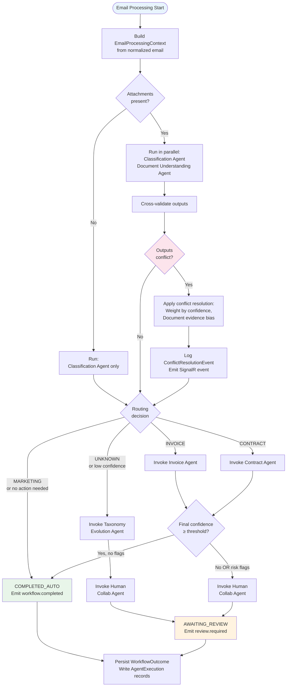
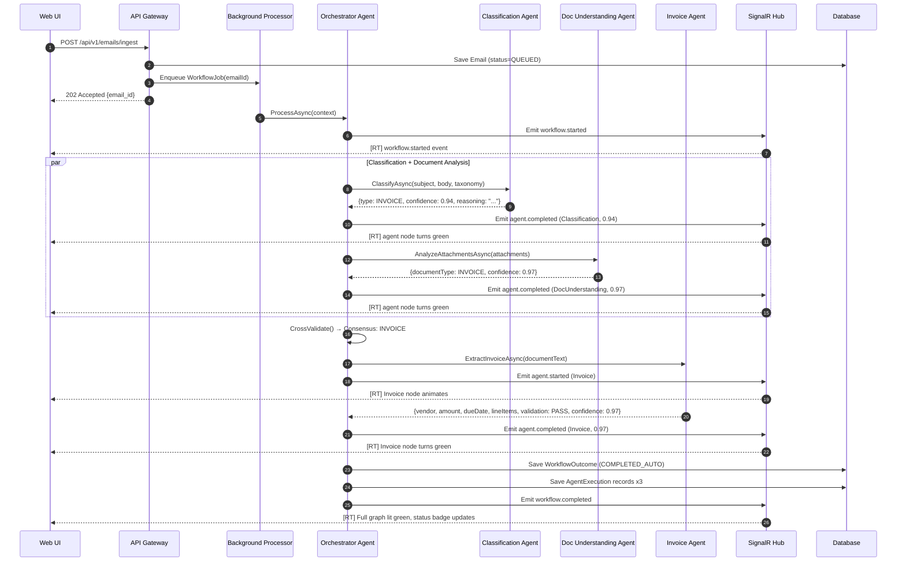
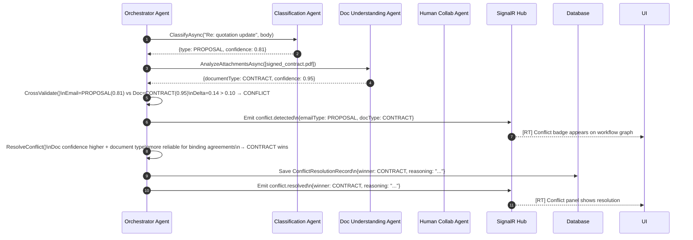
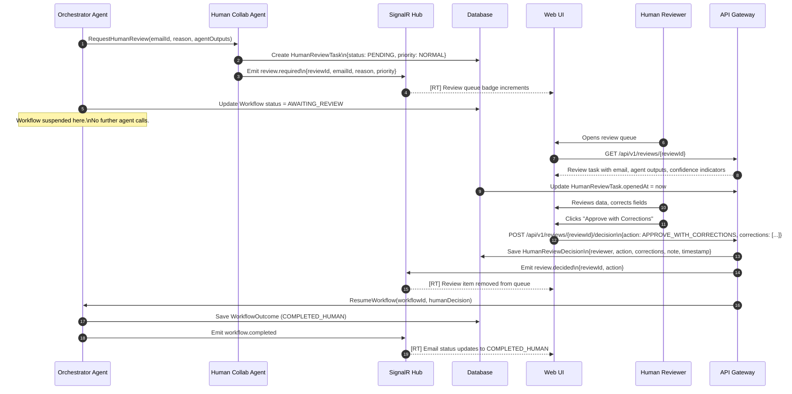

# Section 06 — Multi-Agent Architecture

---

## Agent Model

The platform implements a **Hierarchical Collaborative Agent Model** where a single Orchestrator Agent coordinates a pool of specialized subordinate agents. This model is distinct from peer-to-peer agent meshes or pipeline-only architectures.

### Model Characteristics

| Characteristic | Description |
|----------------|-------------|
| Topology | Star topology — Orchestrator at center, specialists at edges |
| Communication | Unidirectional: Orchestrator → Specialist → Orchestrator |
| State ownership | Orchestrator owns workflow state; specialists are stateless per invocation |
| Parallelism | Orchestrator may invoke non-dependent agents concurrently |
| Conflict arbitration | Orchestrator detects and resolves inter-agent disagreements |
| Human integration | Human Collaboration Agent is a first-class agent, not a side channel |

### Agent Taxonomy

```
Orchestrator Agent (Supervisor)
├── Classification Agent (Analyst)
├── Document Understanding Agent (Router)
│   ├── Invoice Agent (Specialist)
│   └── Contract Agent (Specialist)
├── Taxonomy Evolution Agent (Learner)
└── Human Collaboration Agent (Liaison)
```

---

## Agent Responsibilities

### Orchestrator Agent

The Orchestrator is the workflow controller. It is the only agent with visibility across the entire processing context. It does not perform classification or extraction itself.

**Responsibilities:**
- Receive the normalized email payload from the Application layer
- Determine initial agent invocation strategy based on email characteristics (attachments present? body length? sender domain?)
- Invoke Classification Agent and Document Understanding Agent (potentially in parallel)
- Receive and cross-validate results from Classification Agent and Document Understanding Agent
- Detect conflicts between agent outputs and apply conflict resolution logic
- Invoke the appropriate specialist agent (Invoice or Contract) based on consolidated routing decision
- Determine whether the final output meets the confidence threshold for automated completion
- Invoke Human Collaboration Agent when escalation is required
- Invoke Taxonomy Evolution Agent with low-confidence or unknown-category results
- Record all agent execution events and emit domain events for SignalR streaming
- Write the final `WorkflowOutcome` to the database

**Semantic Kernel Pattern:** `KernelFunction` with a structured `ProcessAsync(EmailProcessingContext)` method. The Orchestrator uses the kernel to invoke subordinate agents as plugins.

---

### Classification Agent

**Responsibilities:**
- Receive: email subject, body (plain text, truncated to token budget), sender metadata
- Produce: `ClassificationResult { Type, Confidence, Reasoning, AlternativeTypes[] }`
- Access the current active taxonomy at runtime to ground classification in known categories
- Return `UNKNOWN` with low confidence when no category matches confidently

**Prompt Strategy:** Zero-shot classification with taxonomy-grounded system prompt. The current taxonomy categories and their signals are injected into the system prompt at invocation time.

**Output Contract:**
```
ClassificationResult
  Type: string            // Taxonomy category label
  Confidence: float       // 0.0 – 1.0
  Reasoning: string       // 1–3 plain-English sentences
  AlternativeTypes: []    // Other candidates with confidence < primary
```

---

### Document Understanding Agent

**Responsibilities:**
- Receive: list of extracted attachment texts and MIME metadata
- For each attachment, determine document type independently of email classification
- Route each attachment to the correct specialist agent
- Report a cross-validation signal to the Orchestrator (does the document type match the email classification?)

**Processing Strategy:** Each attachment is analyzed with a structured prompt. For PDFs, text is extracted using a .NET PDF library (PdfPig). For images, OCR is applied via Azure Document Intelligence (Phase 2). For MVP, image attachments are flagged for human review if text extraction fails.

---

### Invoice Agent

**Responsibilities:**
- Receive: extracted text from an invoice document
- Produce: `InvoiceExtractionResult { Fields, LineItems, FieldConfidences, ValidationResult }`
- Apply schema-constrained structured output via Semantic Kernel
- Run internal validation: math checks, required field presence, date consistency
- Flag specific validation failures by name

**Output Contract:** Strongly typed with per-field confidence. Uses Semantic Kernel's `GetStructuredOutputAsync<T>` to enforce schema compliance.

---

### Contract Agent

**Responsibilities:**
- Receive: extracted text from a contract document
- Produce: `ContractExtractionResult { Parties, Dates, AgreementType, Clauses, RiskFlags }`
- Detect risk indicators using a configurable rule set (clause patterns + LLM analysis)
- Apply severity levels (LOW / MEDIUM / HIGH) to detected risks

**Risk Detection Strategy:** Two-pass approach — (1) LLM extracts key clause data into structured fields, (2) rule-based post-processor evaluates extracted fields against configured thresholds (e.g., liability cap below $500K = MEDIUM risk flag).

---

### Taxonomy Evolution Agent

**Responsibilities:**
- Receive: email ID + extracted signals from Classification Agent when confidence < threshold or type = UNKNOWN
- Persist the email as a taxonomy candidate with its extracted signals
- Cluster incoming candidates by signal similarity
- When a cluster reaches the proposal threshold (default: 3 emails), generate a formal `TaxonomyProposal`
- After human approval, activate the new category and trigger retroactive reclassification of founding samples

**Clustering Strategy:** For MVP, clustering uses keyword overlap and LLM similarity scoring against a short description. Full embedding-based clustering is a Phase 2 enhancement.

---

### Human Collaboration Agent

**Responsibilities:**
- Receive: escalation request from Orchestrator with reason and context payload
- Create a structured `HumanReviewTask` record in the database
- Emit a `review.required` SignalR event to push the task to the active UI
- When a human submits a decision, validate and apply corrections
- Return a `HumanDecisionResult` to the Orchestrator to resume the paused workflow

**Design Note:** The Human Collaboration Agent is unique in that its "completion" is asynchronous and human-driven. The workflow is suspended (status = `AWAITING_REVIEW`) until the human acts. The workflow resumes via a separate HTTP endpoint (`POST /reviews/{id}/decision`) that re-enters the Orchestrator execution.

---

## Agent Lifecycle

```mermaid
stateDiagram-v2
    [*] --> IDLE : Agent registered in DI container

    IDLE --> INVOKED : Orchestrator calls agent

    INVOKED --> BUILDING_PROMPT : Agent prepares context\n(taxonomy, email text, prior outputs)

    BUILDING_PROMPT --> LLM_CALL : Prompt dispatched to\nAzure OpenAI via Semantic Kernel

    LLM_CALL --> PARSING_OUTPUT : Response received\nDeserialized to typed result

    PARSING_OUTPUT --> VALIDATING : Schema and business\nrule validation applied

    VALIDATING --> COMPLETED : Result meets contract

    VALIDATING --> FAILED : Schema violation\nor timeout

    COMPLETED --> IDLE : Result returned to Orchestrator

    FAILED --> IDLE : Error result returned\nOrchestrator handles escalation

    note right of LLM_CALL : Timeout: per-agent max\n(Classification: 10s\nInvoice: 20s\nContract: 30s)

    note right of FAILED : Agent failure does not\ncrash the workflow.\nOrchestrator routes\nto human review.
```

---

## Agent Communication Model

Agents communicate exclusively through the Orchestrator. The communication protocol uses strongly-typed C# records passed as method parameters and return values. There is no event bus between agents.

```
┌─────────────────────────────────────────────────┐
│                 ORCHESTRATOR                     │
│                                                 │
│  EmailProcessingContext (input)                 │
│  ├── emailId                                    │
│  ├── emailText                                  │
│  ├── senderInfo                                 │
│  ├── attachmentTexts[]                          │
│  └── currentTaxonomy                            │
│                                                 │
│  WorkflowState (mutable, owned by Orchestrator) │
│  ├── classificationResult                       │
│  ├── documentResults[]                          │
│  ├── extractionResult                           │
│  ├── conflictReport                             │
│  └── humanDecision                              │
│                                                 │
│  WorkflowOutcome (output)                       │
│  ├── finalClassification                        │
│  ├── extractedData                              │
│  ├── processingPath (AUTO / HUMAN)              │
│  └── agentExecutionIds[]                        │
└─────────────────────────────────────────────────┘
```

---

## Agent Orchestration Strategy

The Orchestrator follows a decision tree that adapts based on email characteristics:



---

## Sequence Diagrams

### Email Processing — Happy Path (Invoice)



---

### Agent Collaboration — Conflict Resolution



---

### Human Intervention Workflow


