# Section 07 — Domain Model

---

## Domain Overview

The domain is organized around the lifecycle of a single business communication — from receipt as a raw email to its final classified, extracted, and audited outcome. The central aggregate is `Email`, with `Workflow` as the processing record and `AgentExecution` as the audit trace.

---

## Entity Relationship Diagram

```mermaid
erDiagram

    EMAIL {
        string Id PK "ULID"
        string IdempotencyKey UK
        string Source "MANUAL_UPLOAD | GRAPH_WEBHOOK"
        string SenderEmail
        string SenderName
        string Subject
        string BodyPlainText
        string BodyHtml
        string RawStoragePath
        datetime ReceivedAt
        datetime IngestedAt
        datetime ProcessedAt
        string Status "QUEUED|PROCESSING|COMPLETED_AUTO|COMPLETED_HUMAN|AWAITING_REVIEW|FAILED"
        int ProcessingDurationMs
        bool HasConflict
        bool HumanReviewed
    }

    ATTACHMENT {
        string Id PK "ULID"
        string EmailId FK
        string Filename
        string MimeType
        int SizeBytes
        string StoragePath
        string ExtractedText
        string DocumentType "INVOICE|CONTRACT|PROPOSAL|UNKNOWN"
        float DocumentTypeConfidence
        string OcrStatus "NOT_REQUIRED|PENDING|COMPLETED|FAILED"
        datetime CreatedAt
    }

    WORKFLOW {
        string Id PK "ULID"
        string EmailId FK
        string Status "QUEUED|PROCESSING|AWAITING_REVIEW|COMPLETED_AUTO|COMPLETED_HUMAN|FAILED"
        string CurrentStep
        string StepHistoryJson
        datetime StartedAt
        datetime CompletedAt
        string CompletedBy "AUTO|HUMAN"
        string OutcomeType
        string ConflictReportJson
    }

    WORKFLOW_STEP {
        string Id PK "ULID"
        string WorkflowId FK
        int StepOrder
        string StepName
        string AgentType
        string Status "PENDING|RUNNING|COMPLETED|FAILED|SKIPPED"
        datetime StartedAt
        datetime CompletedAt
        string InputSummary
        string OutputSummary
    }

    AGENT_EXECUTION {
        string Id PK "ULID"
        string WorkflowId FK
        string EmailId FK
        string AgentType "Orchestrator|Classification|DocUnderstanding|Invoice|Contract|TaxonomyEvolution|HumanCollaboration"
        string AgentVersion
        string Status "COMPLETED|FAILED|TIMEOUT"
        string InputPayloadJson
        string OutputPayloadJson
        float ConfidenceScore
        string ReasoningText
        string FlagsJson
        int DurationMs
        datetime StartedAt
        datetime CompletedAt
        string ErrorMessage
    }

    CLASSIFICATION {
        string Id PK "ULID"
        string EmailId FK
        string AgentExecutionId FK
        string CategoryType
        float Confidence
        string Reasoning
        string AlternativeTypesJson
        string Source "AGENT|HUMAN_OVERRIDE"
        bool IsOverridden
        string OverriddenBy
        datetime OverriddenAt
        datetime CreatedAt
    }

    INVOICE_EXTRACTION {
        string Id PK "ULID"
        string EmailId FK
        string AttachmentId FK
        string AgentExecutionId FK
        string VendorName
        float VendorNameConfidence
        string InvoiceNumber
        float InvoiceNumberConfidence
        string InvoiceDateRaw
        float InvoiceDateConfidence
        string DueDateRaw
        float DueDateConfidence
        decimal TotalAmount
        float TotalAmountConfidence
        decimal TaxAmount
        decimal Subtotal
        string Currency
        string PoReference
        float PoReferenceConfidence
        string PaymentTerms
        string LineItemsJson
        string ValidationStatus "PASS|FAIL"
        string ValidationChecksJson
        float OverallConfidence
        datetime CreatedAt
    }

    CONTRACT_EXTRACTION {
        string Id PK "ULID"
        string EmailId FK
        string AttachmentId FK
        string AgentExecutionId FK
        string PartyA
        float PartyAConfidence
        string PartyB
        float PartyBConfidence
        string AgreementType "MSA|NDA|SOW|SLA|PURCHASE|EMPLOYMENT|OTHER"
        float AgreementTypeConfidence
        string EffectiveDateRaw
        float EffectiveDateConfidence
        string ExpiryDateRaw
        bool AutoRenewal
        int AutoRenewalNoticeDays
        decimal LiabilityCapAmount
        string LiabilityCapCurrency
        bool TerminationForConvenience
        string GoverningLaw
        string PaymentTerms
        float OverallConfidence
        string CalculatedAlertDateRaw
        datetime CreatedAt
    }

    RISK_FLAG {
        string Id PK "ULID"
        string ContractExtractionId FK
        string FlagType "AUTO_RENEWAL_SHORT_NOTICE|LIABILITY_CAP_BELOW_THRESHOLD|UNCAPPED_LIABILITY|UNUSUAL_TERMINATION|BROAD_INDEMNIFICATION"
        string Severity "LOW|MEDIUM|HIGH"
        string Excerpt
        int PageReference
        float Confidence
        datetime CreatedAt
    }

    TAXONOMY_CATEGORY {
        string Id PK "ULID"
        string Label
        string Description
        string Status "ACTIVE|INACTIVE"
        string SignalsJson
        string Routing
        string SuggestedExtractionFieldsJson
        int Version
        string CreatedBy
        datetime CreatedAt
        string ModifiedBy
        datetime ModifiedAt
        int TotalClassifiedCount
    }

    TAXONOMY_PROPOSAL {
        string Id PK "ULID"
        string SuggestedLabel
        string Status "PENDING|APPROVED|DISMISSED"
        float Confidence
        int SampleCount
        string SampleEmailIdsJson
        string SignalsJson
        string SuggestedRouting
        string SuggestedExtractionFieldsJson
        string CreatedByAgent
        string DecidedBy
        datetime DecidedAt
        string DecisionNote
        string ResultingCategoryId FK
        datetime CreatedAt
    }

    TAXONOMY_CANDIDATE {
        string Id PK "ULID"
        string EmailId FK
        string ProposalId FK
        string ExtractedSignalsJson
        float MatchConfidence
        datetime CreatedAt
    }

    HUMAN_REVIEW {
        string Id PK "ULID"
        string EmailId FK
        string WorkflowId FK
        string ReviewType "EXTRACTION_CORRECTION|CLASSIFICATION_OVERRIDE|TAXONOMY_PROPOSAL|CONFLICT_RESOLUTION|RISK_FLAGS"
        string Priority "URGENT|NORMAL|LOW"
        string Status "PENDING|OPEN|DECIDED|ESCALATED"
        string Reason
        float AgentConfidence
        string AssignedTo
        datetime QueuedAt
        datetime OpenedAt
        datetime DecidedAt
        string Action "APPROVE|APPROVE_WITH_CORRECTIONS|REJECT|ESCALATE|REQUEST_MORE_INFO"
        string CorrectionsJson
        string ReviewerNote
        int ReviewDurationSeconds
    }

    AUDIT_ENTRY {
        string Id PK "ULID"
        string EmailId FK
        string EntityType
        string EntityId
        string ActorType "AGENT|HUMAN|SYSTEM"
        string ActorId
        string Action
        string BeforeValueJson
        string AfterValueJson
        string Reasoning
        datetime OccurredAt
    }

    EMAIL ||--o{ ATTACHMENT : "has"
    EMAIL ||--|| WORKFLOW : "drives"
    EMAIL ||--o{ AGENT_EXECUTION : "generates"
    EMAIL ||--o| CLASSIFICATION : "classified by"
    EMAIL ||--o| INVOICE_EXTRACTION : "yields"
    EMAIL ||--o| CONTRACT_EXTRACTION : "yields"
    EMAIL ||--o| HUMAN_REVIEW : "may require"
    EMAIL ||--o{ AUDIT_ENTRY : "audited via"
    EMAIL ||--o{ TAXONOMY_CANDIDATE : "may become"

    WORKFLOW ||--o{ WORKFLOW_STEP : "contains"
    WORKFLOW ||--o{ AGENT_EXECUTION : "records"

    ATTACHMENT ||--o| INVOICE_EXTRACTION : "source of"
    ATTACHMENT ||--o| CONTRACT_EXTRACTION : "source of"

    CONTRACT_EXTRACTION ||--o{ RISK_FLAG : "flags"

    AGENT_EXECUTION ||--o| CLASSIFICATION : "may produce"
    AGENT_EXECUTION ||--o| INVOICE_EXTRACTION : "may produce"
    AGENT_EXECUTION ||--o| CONTRACT_EXTRACTION : "may produce"

    TAXONOMY_CATEGORY ||--o{ CLASSIFICATION : "applied in"
    TAXONOMY_PROPOSAL ||--o{ TAXONOMY_CANDIDATE : "groups"
    TAXONOMY_PROPOSAL ||--o| TAXONOMY_CATEGORY : "becomes"
    HUMAN_REVIEW ||--o{ AUDIT_ENTRY : "audited via"
```

---

## Aggregate Boundaries

The domain is organized into the following aggregates. Each aggregate has a single root that controls all access to its internal entities.

| Aggregate Root | Internal Entities | Invariants |
|----------------|-------------------|------------|
| `Email` | `Attachment` | An email's status can only advance forward through the state machine |
| `Workflow` | `WorkflowStep`, `AgentExecution` | Steps execute in order; no step can start before its predecessor completes |
| `InvoiceExtraction` | `LineItem` (value object) | LineItem totals must reconcile with the overall total (validation concern) |
| `ContractExtraction` | `RiskFlag` | RiskFlag severity must be one of the defined enum values |
| `TaxonomyCategory` | — | Version increments on every modification; label must be unique |
| `TaxonomyProposal` | `TaxonomyCandidate` | Proposal cannot be approved if sample count < 3 |
| `HumanReview` | — | Decision cannot be submitted if status is not OPEN |

---

## Key Domain Events

Domain events represent significant state transitions. They are raised by aggregate methods and dispatched by the Application layer to the SignalR bridge.

| Event | Raised By | Payload |
|-------|-----------|---------|
| `EmailIngestedEvent` | `Email.Create()` | emailId, source, receivedAt |
| `WorkflowStartedEvent` | `Workflow.Start()` | workflowId, emailId |
| `AgentStartedEvent` | `WorkflowStep.Start()` | workflowId, agentType, stepOrder |
| `AgentCompletedEvent` | `WorkflowStep.Complete()` | workflowId, agentType, confidence, durationMs |
| `AgentFailedEvent` | `WorkflowStep.Fail()` | workflowId, agentType, errorMessage |
| `ConflictDetectedEvent` | `Workflow.DetectConflict()` | workflowId, emailType, docType |
| `ConflictResolvedEvent` | `Workflow.ResolveConflict()` | workflowId, winner, reasoning |
| `ReviewRequiredEvent` | `HumanReview.Create()` | reviewId, emailId, priority, reason |
| `ReviewDecidedEvent` | `HumanReview.Decide()` | reviewId, action, correctionCount |
| `WorkflowCompletedEvent` | `Workflow.Complete()` | workflowId, emailId, path, durationMs |
| `TaxonomyProposalCreatedEvent` | `TaxonomyProposal.Create()` | proposalId, suggestedLabel, sampleCount |
| `TaxonomyCategoryCreatedEvent` | `TaxonomyCategory.Activate()` | categoryId, label, createdBy |

---

## Domain Services

These services encapsulate domain logic that does not naturally belong to a single aggregate.

### ConflictResolver

Compares Classification Agent output with Document Understanding Agent output. Determines whether a conflict exists and applies the resolution strategy (document-evidence bias, confidence weighting).

### ConfidenceEvaluator

Applies the routing threshold rules to an agent's confidence score. Returns the recommended processing path: `AUTO`, `REVIEW_RECOMMENDED`, or `HUMAN_REQUIRED`.

### TaxonomyMatcher

Given a set of email signals, scores the signals against each active taxonomy category. Returns the top match with a confidence score. Used by the Taxonomy Evolution Agent for candidate clustering.

### WorkflowStateTransitioner

Validates and applies state transitions on the Workflow aggregate. Enforces the state machine rules and prevents invalid transitions.
