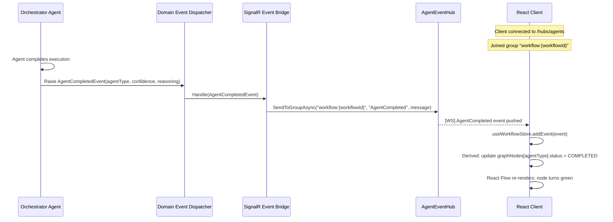

# Section 11 — Real-Time Communication Architecture

---

## Overview

Real-time communication is the architectural mechanism that makes agent collaboration **visible**. Without it, the user submits an email and waits for a page refresh. With it, the user watches the agent workforce assemble, reason, collaborate, and reach a conclusion — in real time. This is the primary demo differentiator.

The architecture uses **ASP.NET Core SignalR** on the server and the **@microsoft/signalr** client library in React. The communication model is **server-push**: the server sends events to connected clients; clients do not poll.

---

## SignalR Hub Design

### AgentEventHub

The single SignalR hub for the entire application. Clients connect once and receive all events for workflows they are observing.

```
Hub URL: /hubs/agents
Protocol: WebSocket (with Long Polling fallback)
Authentication: None (MVP); Bearer token (Phase 2)
```

### Hub Groups

To avoid broadcasting all events to all clients, clients join **workflow-specific groups** when they open an email detail view.

| Group Name | When Joined | Events Received |
|------------|-------------|-----------------|
| `workflow:{workflowId}` | Client opens email detail | All events for that workflow |
| `reviews` | Client opens review queue | `review.required`, `review.decided` |
| `dashboard` | Client has dashboard open | `workflow.completed`, `agent.completed` aggregates |

### Hub Interface

```csharp
// Server-to-client contract (typed hub interface)
interface IAgentEventClient
{
    Task WorkflowStarted(WorkflowStartedMessage message);
    Task AgentStarted(AgentStartedMessage message);
    Task AgentCompleted(AgentCompletedMessage message);
    Task AgentFailed(AgentFailedMessage message);
    Task ConflictDetected(ConflictDetectedMessage message);
    Task ConflictResolved(ConflictResolvedMessage message);
    Task ReviewRequired(ReviewRequiredMessage message);
    Task ReviewDecided(ReviewDecidedMessage message);
    Task WorkflowCompleted(WorkflowCompletedMessage message);
    Task TaxonomyProposalCreated(TaxonomyProposalCreatedMessage message);
    Task DashboardUpdated(DashboardUpdateMessage message);
}
```

---

## Event Message Contracts

### AgentStartedMessage

```json
{
  "workflowId": "01JF8X9K...",
  "emailId": "01JF7X8J...",
  "agentType": "InvoiceAgent",
  "stepOrder": 3,
  "startedAt": "2024-11-15T10:30:06.900Z"
}
```

### AgentCompletedMessage

```json
{
  "workflowId": "01JF8X9K...",
  "emailId": "01JF7X8J...",
  "agentType": "InvoiceAgent",
  "status": "COMPLETED",
  "confidenceScore": 0.97,
  "reasoningText": "All mandatory invoice fields extracted. Math validation passed.",
  "durationMs": 7300,
  "completedAt": "2024-11-15T10:30:14.200Z"
}
```

### ConflictDetectedMessage

```json
{
  "workflowId": "01JF8X9K...",
  "emailId": "01JF7X8J...",
  "emailClassificationType": "PROPOSAL",
  "emailClassificationConfidence": 0.81,
  "documentType": "CONTRACT",
  "documentConfidence": 0.95,
  "detectedAt": "2024-11-15T10:30:05.100Z"
}
```

### ReviewRequiredMessage

```json
{
  "reviewId": "01JG1A2B...",
  "emailId": "01JF7X8J...",
  "reviewType": "EXTRACTION_CORRECTION",
  "priority": "NORMAL",
  "reason": "OCR confidence below threshold — 3 fields uncertain",
  "agentConfidence": 0.51,
  "queuedAt": "2024-11-15T10:30:15.000Z"
}
```

### WorkflowCompletedMessage

```json
{
  "workflowId": "01JF8X9K...",
  "emailId": "01JF7X8J...",
  "path": "COMPLETED_AUTO",
  "classificationType": "INVOICE",
  "totalDurationMs": 14230,
  "completedAt": "2024-11-15T10:30:14.380Z"
}
```

---

## Event Flow Architecture



---

## Client-Side SignalR Integration

### Connection Lifecycle Management

The SignalR connection is managed in a React Context provider (`AgentEventContext`) that wraps the application. The connection uses automatic reconnection with exponential backoff.

```
Connection states:
  CONNECTING → CONNECTED → (active)
                         ↘ RECONNECTING → CONNECTED (on network restore)
                         ↘ DISCONNECTED (terminal; shown in UI as connection error)
```

The `useConnectionStore` Zustand store tracks connection status. A persistent status indicator in the TopBar shows the connection health to users.

### Event Subscription Pattern

```
AgentEventContext (provider — mounted once at App root)
│
├── Creates HubConnection on mount
├── Registers all event handlers: hub.on("AgentCompleted", ...)
├── Manages reconnection logic
└── Provides joinWorkflow(workflowId) and leaveWorkflow(workflowId) functions

Pages that observe a workflow:
│
└── Call joinWorkflow(workflowId) on mount, leaveWorkflow on unmount
    → Sends group join/leave message to hub
```

### React Flow Graph Updates

When a SignalR event arrives, it is processed through a pure transformation function that converts the accumulated event list into React Flow node and edge arrays:

```
agentEvents[] (from Zustand)
    ↓
buildWorkflowGraph(events) → { nodes: Node[], edges: Edge[] }
    ↓
React Flow renders graph
```

`buildWorkflowGraph` is a pure function (no side effects) that is called reactively when `agentEvents` changes. This makes the graph state fully deterministic and testable.

---

## Reconnection and Message Loss Handling

SignalR connections can drop. The architecture handles reconnection as follows:

1. **Client reconnects** after a disconnect
2. **Client re-fetches** full workflow state via `GET /api/v1/emails/{id}/workflow`
3. **Client rebuilds** the React Flow graph from the complete workflow record
4. **Client re-joins** the workflow group on the hub
5. Future events resume normally via push

This approach means the React Flow graph is always consistent with the database — missed events during disconnect are recovered via the REST fetch.

---

## SignalR Infrastructure Considerations

### Scaling (Phase 2)

For multi-instance deployment, SignalR requires a backplane to distribute messages across instances. The recommended backplane for Azure is **Azure SignalR Service**, which handles connection management and message distribution transparently.

For MVP (single App Service instance), no backplane is needed.

### Keep-Alive

SignalR's built-in keep-alive mechanism (`ServerTimeout` = 30 seconds, `KeepAliveInterval` = 15 seconds) is used without modification. This is appropriate for the demo scenario where connections are short-lived and active.

---

## Real-Time Dashboard Updates

The dashboard receives a lightweight `DashboardUpdated` event every time a workflow completes. This event contains only the delta (completed count, queue depth) and triggers a React Query cache invalidation of the dashboard summary endpoint — the dashboard re-fetches the full summary from the server. This avoids complex client-side aggregation logic while still providing a near-real-time dashboard experience (latency: < 2 seconds from workflow completion to dashboard update).
