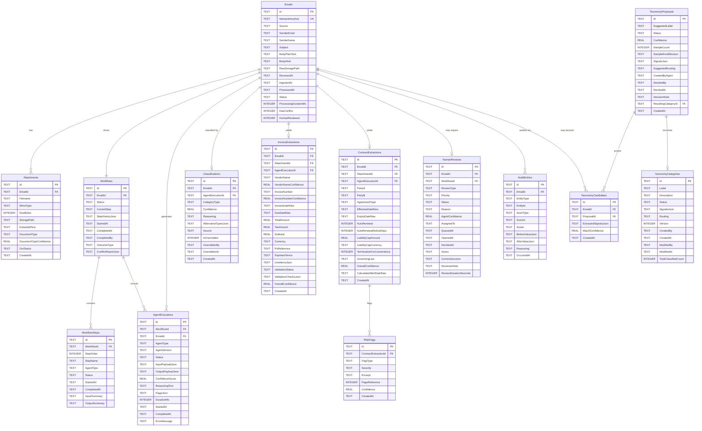

# Section 12 — Data Architecture

---

## Database Strategy

The platform uses **EF Core 9** as the ORM with a provider-agnostic abstraction. For MVP, the provider is **SQLite**. The migration path to PostgreSQL or SQL Server requires only a configuration change and a migration run — no application code changes.

### Provider Configuration

```
appsettings.json:
{
  "DatabaseProvider": "Sqlite",     ← "Sqlite" | "Postgresql" | "SqlServer"
  "ConnectionStrings": {
    "DefaultConnection": "Data Source=inbox.db"
  }
}
```

The `AppDbContext` is registered in DI with the provider selected at startup based on `DatabaseProvider`. EF Core migrations are stored per-provider in separate `Migrations/{Provider}/` folders.

---

## Schema Design

### Core Schema Diagram



---

## Index Strategy

Indexes are defined explicitly in EF Core `IEntityTypeConfiguration<T>` classes. The following indexes are critical for query performance:

| Table | Index Columns | Purpose |
|-------|---------------|---------|
| `Emails` | `(Status, ReceivedAt DESC)` | Queue processing, dashboard list |
| `Emails` | `IdempotencyKey` (UNIQUE) | Deduplication check |
| `Emails` | `(SenderEmail, ReceivedAt DESC)` | Sender-filtered history |
| `AgentExecutions` | `(EmailId, AgentType)` | Reasoning chain fetch |
| `AgentExecutions` | `(WorkflowId, StartedAt)` | Timeline reconstruction |
| `AgentExecutions` | `StartedAt DESC` | Performance metric queries |
| `HumanReviews` | `(Status, Priority, QueuedAt)` | Queue ordering |
| `Classifications` | `(CategoryType, CreatedAt DESC)` | Category statistics |
| `TaxonomyCandidates` | `ProposalId` | Proposal sample grouping |
| `AuditEntries` | `(EmailId, OccurredAt)` | Audit trail retrieval |

---

## Persistence Strategy

### Auditability

The `AuditEntries` table is **append-only**. No audit entry is ever updated or deleted within the retention window. EF Core interceptors (`SaveChangesInterceptor`) automatically create audit entries when key entities change state.

Entities that generate audit entries on state change:
- `Email.Status` transitions
- `Workflow.Status` transitions
- `Classification.IsOverridden` = true
- `HumanReview.Action` set (decision submitted)
- `TaxonomyCategory` created or modified
- `TaxonomyProposal.Status` changed

### Workflow History

The `Workflows.StepHistoryJson` column stores a JSON array of step transition records:
```json
[
  {"step": "CLASSIFYING", "enteredAt": "...", "exitedAt": "..."},
  {"step": "ANALYZING_DOCS", "enteredAt": "...", "exitedAt": "..."},
  ...
]
```
This provides a compact timeline without creating unbounded rows in a separate step-history table.

### Agent Trace Storage

Each `AgentExecution` stores the full `InputPayloadJson` and `OutputPayloadJson` as JSON text columns. This is the raw agent trace — the complete prompt context and response for each LLM call. For MVP, this data is stored inline in SQLite. For Phase 2, large payloads (> 10KB) will be offloaded to blob storage with only a reference stored in the database.

### JSON Column Strategy

SQLite does not have a native JSON column type — JSON is stored as `TEXT`. EF Core's `ToJson()` owned entity mapping is used for value objects (e.g., `LineItem[]`) to serialize/deserialize transparently. For PostgreSQL, the migration to `jsonb` columns is handled in the PostgreSQL-specific EF Core configuration.

---

## Attachment Storage

### MVP — Local Filesystem

Attachments are stored on the local filesystem under `./storage/attachments/{emailId}/{filename}`. The `AttachmentStore` service abstracts all filesystem operations. The path is stored in `Attachments.StoragePath`.

### Phase 2 — Azure Blob Storage

The `IAttachmentStore` interface is implemented by both `LocalAttachmentStore` and `AzureBlobAttachmentStore`. Switching to Azure Blob requires only a DI configuration change. Blob paths use the convention: `attachments/{emailId}/{attachmentId}/{filename}`.

---

## Data Retention

| Data Type | MVP Retention | Production Target |
|-----------|---------------|-------------------|
| Emails (metadata) | Indefinite | 90 days active, archivable |
| Email body text | Indefinite | 90 days, then encrypted archive |
| Attachments (files) | Indefinite | 30 days active, then deleted |
| AgentExecution traces | Indefinite | 90 days |
| AuditEntries | Indefinite | 7 years (compliance) |
| TaxonomyCategories | Indefinite | Indefinite |
| TaxonomyCandidates | Indefinite | 30 days post-proposal decision |

Retention policies are enforced by a background cleanup job (deferred to Phase 2). For MVP, no automated cleanup — disk space is not a concern within the demo dataset.
