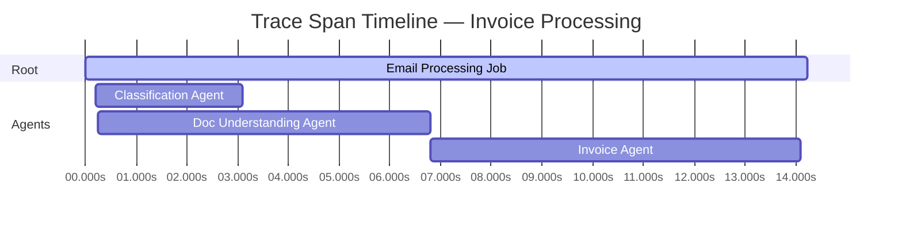
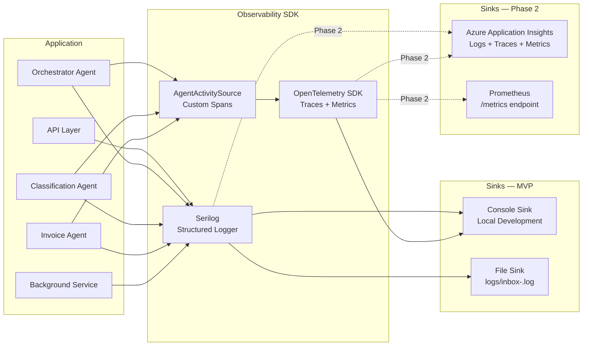

# Section 14 — Observability Architecture

---

## Observability Philosophy

In a multi-agent AI system, observability is more than knowing whether the server is up. It means understanding:
- What each agent reasoned about, and when
- Where time was spent in a multi-step workflow
- Why a human review was triggered
- Whether LLM confidence is calibrated over time
- How the system behaves under concurrent load

The observability stack covers three pillars: **Logs**, **Metrics**, and **Traces** — all correlated by a common `email_id` and `workflow_id` context.

---

## Observability Stack

| Pillar | Tool | Sink (MVP) | Sink (Phase 2) |
|--------|------|-----------|----------------|
| Structured Logging | Serilog | Console + File | Azure Monitor (App Insights) |
| Distributed Tracing | OpenTelemetry | Console exporter | Azure Monitor (App Insights) |
| Metrics | OpenTelemetry Metrics | Console / Prometheus | Azure Monitor |
| Agent Telemetry | Custom ActivitySource | Included in OTel trace | App Insights custom events |

---

## Logging Architecture (Serilog)

### Configuration

Serilog is configured in `Program.cs` before the host is built (`UseSerilog()`), ensuring that startup errors are captured. The minimum event level is configurable per environment:

```
Development: Debug
Staging:     Information
Production:  Warning (exceptions always captured regardless)
```

### Structured Log Schema

All log entries use structured properties — never string interpolation into the message template:

```csharp
Log.Information("Agent {AgentType} completed for {EmailId} with confidence {Confidence}",
    agentType, emailId, confidence);
// → produces: { agentType: "InvoiceAgent", emailId: "...", confidence: 0.97, ... }
```

### Log Enrichers

All logs are enriched with:
- `CorrelationId` — from `X-Correlation-Id` HTTP header (set by `CorrelationIdMiddleware`)
- `EmailId` — pushed into the log context at workflow start
- `WorkflowId` — pushed into the log context at orchestrator entry
- `AgentType` — pushed per-agent invocation
- `MachineName`, `Environment`, `ApplicationVersion`

### Log Categories

| Category | Level | Content |
|----------|-------|---------|
| `AEI.Email.Ingestion` | Information | Email received, attachments detected |
| `AEI.Workflow.Orchestrator` | Information | Workflow steps, agent selections, conflict events |
| `AEI.Agent.{AgentType}` | Information / Debug | Agent invocation, confidence, reasoning summary |
| `AEI.Agent.LLM` | Debug | Token counts, prompt length (not prompt content) |
| `AEI.Review.Queue` | Information | Review task created, opened, decided |
| `AEI.Taxonomy` | Information | Proposal created, category approved |
| `AEI.Infrastructure` | Warning / Error | DB errors, storage failures, LLM timeouts |

### What Is NOT Logged

- Email body content or attachment text (PII / sensitive business data)
- Full LLM prompt text (may contain email content)
- LLM API keys or authentication tokens
- Full JSON payloads for agent I/O (available in `AgentExecutions` table; not in log stream)

---

## Distributed Tracing Architecture (OpenTelemetry)

### Trace Structure

Each email processing job produces a single **root trace** with child spans per agent. All spans share the same `TraceId`, enabling a full execution timeline in App Insights (Phase 2).



### Custom ActivitySource

A custom `ActivitySource` named `AEI.Agents` is registered and used throughout the agent layer:

```csharp
// AgentActivitySource.cs
public static class AgentActivitySource
{
    public static readonly ActivitySource Source = new("AEI.Agents", "1.0.0");

    public static Activity? StartAgentActivity(string agentType, string emailId)
        => Source.StartActivity($"Agent/{agentType}",
            tags: [
                new("aei.agent.type", agentType),
                new("aei.email.id", emailId),
                new("aei.workflow.id", workflowId)
            ]);
}
```

### Span Attributes

Each agent span includes:

| Attribute | Value |
|-----------|-------|
| `aei.agent.type` | `InvoiceAgent` / `ClassificationAgent` / etc. |
| `aei.email.id` | Email ULID |
| `aei.workflow.id` | Workflow ULID |
| `aei.agent.confidence` | `0.97` |
| `aei.agent.status` | `COMPLETED` / `FAILED` / `TIMEOUT` |
| `aei.llm.model` | `gpt-4o` |
| `aei.llm.prompt_tokens` | `1842` |
| `aei.llm.completion_tokens` | `312` |
| `aei.llm.total_tokens` | `2154` |

### HTTP Client Tracing

The `HttpClient` used by Semantic Kernel to call Azure OpenAI is instrumented automatically via `AddHttpClientInstrumentation()` in the OTel configuration. This captures the HTTP call duration to Azure OpenAI as a child span of the agent span.

---

## Metrics Architecture

### Registered Instruments

All instruments are registered under the meter name `AEI.Platform`:

| Instrument | Type | Description |
|------------|------|-------------|
| `aei.emails.ingested` | Counter | Total emails ingested |
| `aei.emails.processed` | Counter (+ status tag) | Total emails processed, split by COMPLETED_AUTO / COMPLETED_HUMAN / FAILED |
| `aei.workflow.duration` | Histogram | End-to-end workflow duration in ms |
| `aei.agent.duration` | Histogram (+ agent_type tag) | Per-agent execution duration |
| `aei.agent.confidence` | Histogram (+ agent_type tag) | Per-agent confidence score distribution |
| `aei.agent.errors` | Counter (+ agent_type tag) | Agent failures / timeouts |
| `aei.review.queue_depth` | ObservableGauge | Current pending review tasks |
| `aei.review.resolution_time` | Histogram | Minutes from review queued to decided |
| `aei.taxonomy.proposals_created` | Counter | Taxonomy proposals generated |
| `aei.taxonomy.proposals_approved` | Counter | Taxonomy proposals approved by humans |
| `aei.llm.tokens_used` | Counter (+ model tag) | Total Azure OpenAI tokens consumed |

---

## Agent Telemetry

Beyond standard OTel spans, agents emit **business-level telemetry events** captured as custom dimensions in App Insights (Phase 2) or written to the `AgentExecutions` table (MVP):

### Confidence Calibration Tracking

The `aei.agent.confidence` histogram, combined with human correction data from `HumanReviews`, enables calibration analysis:
- An agent reporting 0.90 confidence should be correct ~90% of the time
- Human corrections on high-confidence outputs signal overconfidence
- This data drives prompt tuning in subsequent sprint iterations

### Token Budget Monitoring

`aei.llm.tokens_used` counter enables cost and performance tracking:
- Alerts when daily token consumption exceeds budget thresholds
- Identifies which agent types consume the most tokens (candidates for prompt optimization)
- Enables capacity planning for Azure OpenAI TPM (Tokens Per Minute) limits

---

## Observability Architecture Diagram



---

## Health Check Architecture

Two health check endpoints are registered:

### `/health` — Liveness

Returns `200 OK` if the application process is running and not deadlocked. Used by Azure App Service to determine if the instance should be restarted.

### `/health/ready` — Readiness

Returns `200 OK` only if all dependencies are reachable:
1. Database connection: `SELECT 1` query succeeds
2. Azure OpenAI: HTTP GET to the deployment endpoint returns 200 or 401 (auth is expected; 500 means unreachable)

In the MVP, readiness failure degrades gracefully — emails are queued but agent processing is suspended until the LLM API is reachable.

---

## Workflow Monitoring UI

The Dashboard page serves as the operational monitoring surface for the MVP. It shows:
- Live agent execution feed (driven by SignalR `AgentStarted` / `AgentCompleted` events)
- Queue depth and throughput metrics
- Review queue depth
- Taxonomy proposal count

In Phase 2, an Azure Application Insights dashboard is configured with:
- Live metrics stream
- End-to-end transaction search by email ID
- Custom workbook for confidence calibration analysis
- Alert rules on key SLOs (processing time P95, error rate, review queue depth)
