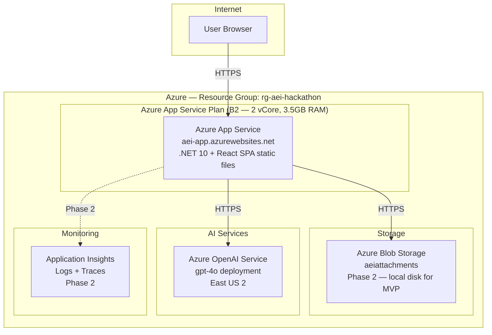
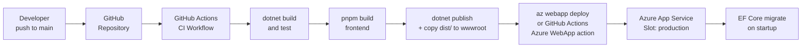
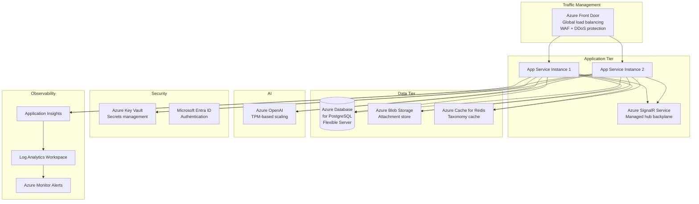

# Section 15 — Deployment Architecture

---

## Local Development Environment

The local development environment is designed for zero-infrastructure-dependency setup. A developer must only provide Azure OpenAI credentials to run the full stack locally.

### Prerequisites

| Tool | Version | Purpose |
|------|---------|---------|
| .NET SDK | 10.x | Backend build and run |
| Node.js | 20.x LTS | Frontend build and dev server |
| pnpm | 9.x | Frontend package manager |
| Git | Any | Version control |
| VS Code or Rider | Any | IDE |

### Local Setup Steps

```
1. Clone repository
   git clone https://github.com/jasonfabian/JF.AgenticEnterprise.Inbox

2. Configure secrets (never commit these)
   cd src/JF.AgenticEnterprise.Inbox.Api
   dotnet user-secrets set "AzureOpenAI__ApiKey" "your-key"
   dotnet user-secrets set "AzureOpenAI__Endpoint" "https://your-resource.openai.azure.com/"
   dotnet user-secrets set "AzureOpenAI__DeploymentName" "gpt-4o"

3. Run database migration (creates inbox.db)
   dotnet ef database update

4. Run backend
   dotnet run --project src/JF.AgenticEnterprise.Inbox.Api
   → Listening on http://localhost:5000

5. Run frontend
   cd frontend
   pnpm install
   pnpm dev
   → Listening on http://localhost:5173
```

### Local Configuration

```json
// appsettings.Development.json (committed — no secrets here)
{
  "DatabaseProvider": "Sqlite",
  "ConnectionStrings": {
    "DefaultConnection": "Data Source=inbox.db"
  },
  "AzureOpenAI": {
    "ApiKey": "",      // set via user-secrets
    "Endpoint": "",    // set via user-secrets
    "DeploymentName": ""
  },
  "AttachmentStorage": {
    "Provider": "Local",
    "LocalPath": "./storage/attachments"
  },
  "Observability": {
    "MinimumLevel": "Debug",
    "EnableConsoleExporter": true
  },
  "SignalR": {
    "EnableDetailedErrors": true
  },
  "Cors": {
    "AllowedOrigins": ["http://localhost:5173"]
  }
}
```

---

## Docker Architecture

Docker Compose provides a fully containerized local environment. This is the recommended setup for CI and for environments where .NET SDK is not installed.

### Compose File Structure

```
docker-compose.yml          ← Base services
docker-compose.override.yml ← Development overrides (hot reload, debug ports)
docker-compose.prod.yml     ← Production-like local testing
```

### Service Definitions

```yaml
# docker-compose.yml (conceptual structure — not code)

services:

  inbox-api:
    build:
      context: .
      dockerfile: src/JF.AgenticEnterprise.Inbox.Api/Dockerfile
      target: runtime
    environment:
      - DatabaseProvider=Sqlite
      - ConnectionStrings__DefaultConnection=Data Source=/data/inbox.db
      - AzureOpenAI__ApiKey=${AZURE_OPENAI_KEY}
      - AzureOpenAI__Endpoint=${AZURE_OPENAI_ENDPOINT}
      - AzureOpenAI__DeploymentName=${AZURE_OPENAI_DEPLOYMENT}
      - ASPNETCORE_ENVIRONMENT=Production
      - ASPNETCORE_URLS=http://+:8080
    volumes:
      - inbox-data:/data
      - inbox-attachments:/app/storage/attachments
    ports:
      - "5000:8080"
    healthcheck:
      test: ["CMD", "curl", "-f", "http://localhost:8080/health/ready"]
      interval: 30s
      timeout: 10s
      retries: 3

  inbox-frontend:
    build:
      context: frontend
      dockerfile: Dockerfile
    ports:
      - "3000:80"
    depends_on:
      inbox-api:
        condition: service_healthy

volumes:
  inbox-data:
  inbox-attachments:
```

### Dockerfile Strategy

**Backend Dockerfile** (multi-stage):
```
Stage 1: sdk (mcr.microsoft.com/dotnet/sdk:10.0)
  - Restore packages
  - Build and publish

Stage 2: runtime (mcr.microsoft.com/dotnet/aspnet:10.0)
  - Copy published output from stage 1
  - Run as non-root user
  - EXPOSE 8080
  - ENTRYPOINT ["dotnet", "JF.AgenticEnterprise.Inbox.Api.dll"]
```

**Frontend Dockerfile** (multi-stage):
```
Stage 1: node:20-alpine
  - Install pnpm
  - Install dependencies
  - Build production bundle (pnpm build)

Stage 2: nginx:alpine
  - Copy dist/ from stage 1
  - Copy nginx.conf (SPA routing: try_files $uri /index.html)
  - Proxy /api and /hubs to backend service
  - EXPOSE 80
```

---

## Azure Deployment Architecture

### MVP Azure Topology



### App Service Configuration

| Setting | Value |
|---------|-------|
| SKU | B2 (MVP: sufficient for demo load) |
| Runtime | .NET 10 (Linux container) |
| Always On | Enabled (prevents cold starts during demo) |
| HTTPS Only | Enabled |
| HTTP Version | 2.0 |
| WebSockets | Enabled (required for SignalR) |
| Startup Command | `dotnet JF.AgenticEnterprise.Inbox.Api.dll` |

### Environment Variables in App Service

All configuration is provided via App Service Application Settings (mapped to `ASPNETCORE_` environment variables):

```
ASPNETCORE_ENVIRONMENT=Production
DatabaseProvider=Sqlite
ConnectionStrings__DefaultConnection=Data Source=/home/site/wwwroot/data/inbox.db
AzureOpenAI__ApiKey=[Key Vault reference: @Microsoft.KeyVault(SecretUri=...)]
AzureOpenAI__Endpoint=[Key Vault reference]
AzureOpenAI__DeploymentName=gpt-4o
AttachmentStorage__Provider=Local
AttachmentStorage__LocalPath=/home/site/wwwroot/storage/attachments
```

### Deployment Pipeline



**Deployment Method:** GitHub Actions using `azure/webapps-deploy` action. The workflow is triggered on merge to `main`. The frontend is built and copied into `wwwroot/` of the .NET publish output — creating a single deployment artifact that serves both API and SPA.

---

## Phase 2 — Production Architecture

For a production-grade deployment, the architecture evolves to support multiple instances, persistent database, and enterprise security:



### Key Phase 2 Infrastructure Changes

| Component | MVP | Phase 2 |
|-----------|-----|---------|
| Database | SQLite (file) | Azure Database for PostgreSQL Flexible Server |
| Attachment storage | Local App Service disk | Azure Blob Storage |
| SignalR backplane | None (single instance) | Azure SignalR Service |
| Secrets | App Service settings | Azure Key Vault + Managed Identity |
| Authentication | None | Microsoft Entra ID |
| Load balancing | Single instance | Azure Front Door + multiple instances |
| Cache | None | Azure Cache for Redis (taxonomy) |
| Monitoring | Console + file logs | Application Insights + Log Analytics |
