# Section 17 — MVP Architecture

---

## MVP Mandate

The MVP must deliver a **compelling, reliable, 5-minute hackathon demonstration** that clearly satisfies the Microsoft Agents League Reasoning Agents judging criteria. Every architectural decision at the MVP boundary is evaluated against this mandate, not against production completeness.

The MVP is **not a subset of the full product** — it is a carefully curated demonstration of the full product's core ideas, implemented with enough depth to be real but with enough simplification to be deliverable.

---

## Components Required for Hackathon MVP

### Backend Components

| Component | Status | Notes |
|-----------|--------|-------|
| ASP.NET Core Minimal API host | **Required** | Entry point for all interactions |
| Email ingestion endpoint | **Required** | Demo entry point |
| WorkflowBackgroundService (Channel-based) | **Required** | Async processing |
| Orchestrator Agent | **Required** | Core coordination — must be visually compelling |
| Classification Agent | **Required** | First agent in every flow |
| Document Understanding Agent | **Required** | Drives document routing |
| Invoice Agent | **Required** | Primary document type in demo |
| Contract Agent | **Required** | Second document type; drives risk flag demo moment |
| Taxonomy Evolution Agent | **Required** | Required for taxonomy learning demo segment |
| Human Collaboration Agent | **Required** | Required for human-in-the-loop demo segment |
| Conflict detection + resolution in Orchestrator | **Required** | Key differentiator moment |
| SignalR AgentEventHub | **Required** | Real-time visualization driver |
| Domain event → SignalR bridge | **Required** | Connects agent logic to UI |
| EF Core + SQLite persistence | **Required** | All domain entities persisted |
| AgentExecution records (reasoning chain) | **Required** | Explainability feature |
| HumanReview queue + decision endpoint | **Required** | Human-in-the-loop demo |
| Taxonomy proposal creation + approval | **Required** | Taxonomy evolution demo |
| AuditEntry recording | **Required** | Auditability demonstration |
| Dashboard summary endpoint | **Required** | Demo centerpiece endpoint |
| Health check endpoints | **Required** | Demo reliability |
| PDF text extraction (PdfPig) | **Required** | Invoice + contract attachment processing |
| Seed data for demo emails | **Required** | Predictable demo flow |

### Frontend Components

| Component | Status | Notes |
|-----------|--------|-------|
| React SPA shell + routing | **Required** | Application container |
| Email submission form | **Required** | Demo entry point |
| Email list with status badges | **Required** | Post-submission visibility |
| WorkflowGraph (React Flow) | **Required** | Primary visual differentiator |
| AgentNode (custom React Flow node) | **Required** | Per-agent status display |
| ReasoningPanel (side panel) | **Required** | Explainability feature |
| ConflictBadge component | **Required** | Conflict demo moment |
| SignalR client + event handlers | **Required** | Real-time updates |
| Dashboard page | **Required** | Demo overview screen |
| Review queue page | **Required** | Human-in-the-loop demo |
| Structured review form (invoice) | **Required** | Field correction demo |
| Risk flag display (contract review) | **Required** | Risk detection demo |
| Taxonomy proposal approval UI | **Required** | Taxonomy learning demo |
| Confidence indicators (color coding) | **Required** | Explainability visual |
| ConfidenceBadge / StatusPill components | **Required** | Shared UI atoms |

---

## Components Deferred to Future Releases

### Deferred to Phase 2

| Component | Reason for Deferral |
|-----------|---------------------|
| Microsoft 365 / Graph API mailbox integration | Setup complexity; not needed for demo with manual submission |
| Azure Blob Storage for attachments | Local filesystem is sufficient for demo file sizes |
| Microsoft Entra ID authentication | No multi-user demo scenario; adds setup friction |
| Role-based authorization (RBAC) | Single-user demo; no access control needed |
| Azure SignalR Service backplane | Single App Service instance; no multi-instance scenario |
| Azure Key Vault integration | User secrets / App Service settings sufficient for demo |
| Microsoft Teams notifications | No Teams in demo environment |
| ERP export integration | Simulated in demo via "Export to ERP" button (no-op) |
| OCR via Azure Document Intelligence | PdfPig sufficient for clean PDFs; scanned docs flagged to human review |
| Contract renewal alert scheduling | Dates extracted and stored; alert delivery deferred |
| Multi-language support | English-only demo |
| Taxonomy category editing/deactivation UI | Browser only; no modification needed in demo |
| Agent performance metrics dashboard | Dashboard shows summary; per-agent trend charts deferred |
| Human review workload management | Single reviewer in demo |
| Data retention cleanup jobs | No data volume concern in demo |
| PDF/export of audit trail | Audit trail viewable in UI; export deferred |

### Deferred to Phase 3+

| Component | Reason for Deferral |
|-----------|---------------------|
| Multi-tenant architecture | Single organization scope for MVP and Phase 2 |
| Custom agent builder (no-code) | Phase 3 capability |
| Embedding-based taxonomy clustering | Phase 2 enhancement (LLM-similarity for MVP) |
| Federated learning across tenants | Phase 3 |
| Compliance mode (GDPR/HIPAA/SOC2) | Phase 3 |
| Advanced analytics and trend detection | Phase 3 |

---

## Simplifications Accepted for MVP

### Simplification 1 — SQLite Instead of PostgreSQL

**Why accepted:** Eliminates all database infrastructure setup for local development and Azure deployment. Demo data volume (< 100 emails) is well within SQLite's capabilities.

**Migration path:** EF Core provider swap + `dotnet ef database update`. No application code changes. Estimated effort: 1–2 hours.

---

### Simplification 2 — In-Process Channel Instead of Message Queue

**Why accepted:** Eliminates Azure Service Bus or RabbitMQ dependency. For a single-instance demo, `Channel<T>` is functionally equivalent to an external queue.

**Accepted risk:** In-flight jobs lost on application restart. For demo: acceptable (restart the demo).

**Migration path:** Replace `WorkflowBackgroundService` with a Service Bus trigger consumer. `WorkflowCoordinator` and all agents unchanged. Estimated effort: 1 day.

---

### Simplification 3 — No Authentication

**Why accepted:** Demo is single-user in a controlled environment. Adding Entra ID authentication requires App Registration setup, redirect URI configuration, and MSAL integration — all valuable but irrelevant to the AI Reasoning Agents judging criteria.

**Migration path:** Add `AddAuthentication().AddMicrosoftIdentityWebApi()` to backend; add `@azure/msal-react` to frontend; add `[Authorize]` to endpoint groups. Estimated effort: 2–3 days.

---

### Simplification 4 — Local File Storage for Attachments

**Why accepted:** Demo attachments are small (<2MB). Local App Service disk storage is sufficient. No Azure Blob configuration needed.

**Migration path:** Register `AzureBlobAttachmentStore` instead of `LocalAttachmentStore` in DI. Update connection string configuration. Estimated effort: 4 hours.

---

### Simplification 5 — No Email Deduplication via External Store

**Why accepted:** Idempotency key is checked in SQLite synchronously. For demo volume (single-digit concurrent submissions), this is sufficient. For high-volume production, a distributed cache check is required.

**Migration path:** Add Redis distributed cache check before database insert. Estimated effort: 1 day.

---

### Simplification 6 — Synchronous Domain Event Dispatch

**Why accepted:** Domain events are dispatched synchronously within the same request/background processing thread. For demo, this ensures SignalR events are sent before the next agent starts — providing cleaner animation sequencing.

**Migration path:** Introduce MediatR or a lightweight event bus for async dispatch. Estimated effort: 1 day.

---

## MVP Architecture Diagram

```mermaid
graph TB
    subgraph "What's IN the MVP"
        direction TB
        UI[React SPA\nAll 6 pages\nReact Flow graph]
        API[ASP.NET Core\nMinimal APIs\n6 endpoint groups]
        SIGNALR[SignalR\nAgentEventHub]
        ORCH[Orchestrator Agent]
        CL[Classification Agent]
        DU[Document Understanding Agent]
        INV[Invoice Agent]
        CON[Contract Agent]
        TAX[Taxonomy Evolution Agent]
        HC[Human Collaboration Agent]
        PDF[PdfPig\nText Extraction]
        CH[Channel WorkflowJob\nBackground Service]
        EF[EF Core + SQLite]
        SK[Semantic Kernel\nAzure OpenAI GPT-4o]
    end

    subgraph "What's NOT in the MVP"
        direction TB
        GRAPH[MS Graph\nMailbox Sync]
        BLOB[Azure Blob\nStorage]
        AUTH[Entra ID\nAuthentication]
        TEAMS[Teams\nNotifications]
        OCR[Azure Document\nIntelligence OCR]
        SB[Azure Service\nBus]
        KV[Azure Key\nVault]
        REDIS[Redis\nCache]
    end

    style UI fill:#c8e6c9
    style API fill:#c8e6c9
    style SIGNALR fill:#c8e6c9
    style ORCH fill:#c8e6c9
    style CL fill:#c8e6c9
    style DU fill:#c8e6c9
    style INV fill:#c8e6c9
    style CON fill:#c8e6c9
    style TAX fill:#c8e6c9
    style HC fill:#c8e6c9
    style PDF fill:#c8e6c9
    style CH fill:#c8e6c9
    style EF fill:#c8e6c9
    style SK fill:#c8e6c9

    style GRAPH fill:#ffccbc
    style BLOB fill:#ffccbc
    style AUTH fill:#ffccbc
    style TEAMS fill:#ffccbc
    style OCR fill:#ffccbc
    style SB fill:#ffccbc
    style KV fill:#ffccbc
    style REDIS fill:#ffccbc
```

---

## MVP Quality Gates

Before the hackathon demo, the following quality gates must pass:

| Gate | Criteria |
|------|----------|
| All 5 demo scenarios run end-to-end | Invoice, Contract+Risk, Conflict, Taxonomy Evolution, Human Review |
| Agent timeline renders live | Nodes animate within 2s of agent completion |
| Processing completes in < 30s | For standard invoice + PDF attachment |
| Conflict demo is reliable | Conflict email consistently produces conflict detection |
| Taxonomy proposal appears after 3 unknowns | Consistent across 3 consecutive unknown email submissions |
| Human review decision applies correctly | Corrections saved; email status updates in UI |
| No unhandled errors during demo flow | ErrorBoundary catches; no white screens |
| Demo runs offline | SQLite + seeded data available without Azure OpenAI (pre-cached responses optional) |
