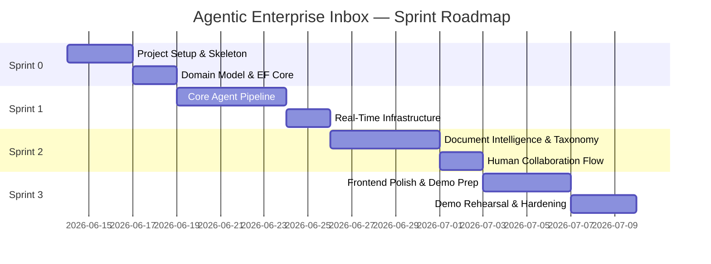

# Section 18 — Development Roadmap

---

## Roadmap Overview

The development timeline is organized into four sprints, each with a clear technical milestone and demonstrable output. The sprint structure prioritizes having a working, demo-ready artifact at the end of every sprint — never a partially assembled system.

---

## Sprint 0 — Foundation and Structure

**Goal:** A running skeleton application with all project structures, the domain model, and the database in place. Every subsequent sprint builds on this foundation.

**Duration:** ~5 days

### Technical Deliverables

#### Backend Foundation

- [ ] Create solution structure: Domain, Application, Infrastructure, Api projects
- [ ] Define all domain entities with correct relationships
- [ ] Define all domain events as C# records
- [ ] Define all agent and repository interfaces
- [ ] Configure EF Core AppDbContext with all entity configurations
- [ ] Write and run initial EF Core migration (creates `inbox.db`)
- [ ] Seed initial taxonomy categories (Invoice, Contract, Proposal, Info Request, Marketing, Bank Statement, Unknown)
- [ ] Register all DI services (empty implementations where needed)
- [ ] Configure Serilog structured logging (console sink)
- [ ] Configure OpenTelemetry (console exporter)
- [ ] Implement CorrelationId middleware
- [ ] Implement RFC 7807 error handling middleware
- [ ] Implement health check endpoints (`/health`, `/health/ready`)
- [ ] Configure CORS for local development
- [ ] Configure OpenAPI / Swagger

#### Backend Stub Layer

- [ ] Implement stub agent classes that return hardcoded results (enables frontend integration before LLM is wired)
- [ ] Implement `WorkflowJobChannel` and `WorkflowBackgroundService` (processes stubs)
- [ ] Implement `POST /api/v1/emails/ingest` → returns 202 Accepted
- [ ] Implement `GET /api/v1/emails/{id}` → returns stub processing result
- [ ] Implement `GET /api/v1/emails` → returns empty list

#### Frontend Foundation

- [ ] Initialize Vite + React + TypeScript project
- [ ] Configure Tailwind CSS and shadcn/ui
- [ ] Install and configure React Router v6
- [ ] Install React Query (TanStack Query v5)
- [ ] Install Zustand
- [ ] Install @microsoft/signalr
- [ ] Install React Flow (@xyflow/react)
- [ ] Implement AppShell (layout with sidebar navigation)
- [ ] Implement API client (`src/lib/api/client.ts`) pointing to `http://localhost:5000`
- [ ] Implement SignalR context provider (`AgentEventContext.tsx`)
- [ ] Create all 6 page routes (empty placeholder pages)
- [ ] Verify SignalR connects to hub and receives events from stub agents

#### Infrastructure & DevOps

- [ ] Configure `.gitignore` (exclude `inbox.db`, `*.user`, `storage/`, `.env`, `user-secrets`)
- [ ] Configure dotnet user-secrets for local Azure OpenAI credentials
- [ ] Create `README.md` with setup instructions
- [ ] Create `docker-compose.yml` skeleton (services defined, volumes configured)

**Sprint 0 Exit Criteria:**
- `dotnet run` starts the API without errors
- `pnpm dev` starts the frontend without errors
- Browser navigates to all 6 pages without errors
- SignalR connection shown as CONNECTED in browser DevTools
- `/health/ready` returns 200

---

## Sprint 1 — Core Agent Pipeline

**Goal:** A fully functional email processing pipeline with real LLM-powered agents, real-time SignalR events, and the agent visualization graph working live in the browser.

**Duration:** ~7 days

### Technical Deliverables

#### Agent Implementation

- [ ] Implement `AgentKernelFactory` — creates `Kernel` instances per agent type with Azure OpenAI registered
- [ ] Implement `PromptTemplateLoader` — loads `.prompty` files from disk
- [ ] Write and test Classification Agent prompt (`classification.prompty`)
- [ ] Implement `ClassificationAgent` — invokes LLM, parses `ClassificationResult`
- [ ] Write and test Document Understanding Agent prompt (`document-understanding.prompty`)
- [ ] Implement `DocumentUnderstandingAgent` — invokes LLM per attachment, returns document type
- [ ] Implement `PdfPigTextExtractor` — extracts text from PDF attachments
- [ ] Implement `LocalAttachmentStore` — saves and retrieves attachment files
- [ ] Implement `OrchestratorAgent` full logic:
  - Build `EmailProcessingContext`
  - Invoke Classification + Document Understanding in parallel
  - Cross-validate, detect conflict, resolve
  - Route to specialist agent
  - Evaluate confidence threshold
  - Persist `AgentExecution` records
  - Emit domain events

#### SignalR Real-Time Events

- [ ] Implement `AgentEventHub` (typed hub with `IAgentEventClient`)
- [ ] Implement `SignalREventBridge` — translates domain events to hub group messages
- [ ] Wire Orchestrator domain events → bridge → hub
- [ ] Implement all SignalR event handlers in frontend (`AgentEventContext.tsx`)
- [ ] Implement `useWorkflowStore` Zustand store
- [ ] Implement `buildWorkflowGraph()` pure function

#### React Flow Agent Graph

- [ ] Implement `WorkflowGraph` wrapper component
- [ ] Implement `AgentNode` custom React Flow node (icon, label, status indicator, confidence gauge)
- [ ] Implement `AgentEdge` animated directional edge
- [ ] Implement `ReasoningPanel` — shows reasoning text, confidence on node click
- [ ] Integrate WorkflowGraph into EmailDetailPage
- [ ] Test: submit invoice email → graph animates in real time → all nodes turn green

#### API Completion (Sprint 1 scope)

- [ ] Complete `GET /api/v1/emails/{id}` with full agent execution outputs
- [ ] Complete `GET /api/v1/emails` with pagination and status filtering

**Sprint 1 Exit Criteria:**
- Invoice email submitted → Classification Agent classifies as INVOICE with confidence ≥ 0.85
- Document Understanding Agent identifies PDF as invoice
- Invoice Agent extraction produces all mandatory fields
- Agent timeline graph animates live in the browser during processing
- Reasoning panel shows plain-English reasoning for each agent
- Processing completes in < 20 seconds for a clean PDF invoice

---

## Sprint 2 — Document Intelligence, Taxonomy Evolution, Human Collaboration

**Goal:** All remaining agents operational. Taxonomy evolution loop works end-to-end. Human review queue functional with structured review UI.

**Duration:** ~7 days

### Technical Deliverables

#### Invoice and Contract Agents

- [ ] Write and test Invoice Agent prompt (`invoice-extraction.prompty`)
- [ ] Implement `InvoiceAgent` — structured extraction with per-field confidence
- [ ] Implement invoice validation logic (math checks, date checks, required fields)
- [ ] Write and test Contract Agent prompts (`contract-extraction.prompty`, `contract-risk-flags.prompty`)
- [ ] Implement `ContractAgent` — metadata extraction + risk flag detection
- [ ] Implement risk flag rule-based post-processor (liability cap threshold, auto-renewal notice period)
- [ ] Persist `InvoiceExtraction`, `ContractExtraction`, `RiskFlag` entities

#### Taxonomy Evolution Agent

- [ ] Write and test Taxonomy Evolution Agent prompts (`taxonomy-clustering.prompty`, `taxonomy-proposal.prompty`)
- [ ] Implement `TaxonomyEvolutionAgent`:
  - Create `TaxonomyCandidate` records for unknown emails
  - Query for candidate clusters
  - Generate `TaxonomyProposal` when threshold (3) is reached
  - Invoke Human Collaboration Agent with proposal
- [ ] Implement retroactive reclassification after proposal approval
- [ ] Implement `GET /api/v1/taxonomy/proposals`
- [ ] Implement `POST /api/v1/taxonomy/proposals/{id}/approve`
- [ ] Implement `POST /api/v1/taxonomy/proposals/{id}/dismiss`
- [ ] Implement `GET /api/v1/taxonomy/categories`

#### Human Collaboration Agent and Review Queue

- [ ] Implement `HumanCollaborationAgent`:
  - Create `HumanReview` records
  - Emit `ReviewRequiredEvent` → SignalR
  - Handle workflow suspension / resume
- [ ] Implement `GET /api/v1/reviews/queue`
- [ ] Implement `GET /api/v1/reviews/{id}`
- [ ] Implement `POST /api/v1/reviews/{id}/decision`
- [ ] Implement workflow resume on review decision

#### Frontend — Review and Taxonomy

- [ ] Implement `ReviewQueuePage` with priority-sorted queue
- [ ] Implement `ReviewDetailPage` with side-by-side document/field view
- [ ] Implement `InvoiceReviewForm` with inline field editing + confidence color
- [ ] Implement `ContractReviewPanel` with risk flag list
- [ ] Implement `DecisionPanel` (Approve / Approve with Corrections / Reject / Escalate)
- [ ] Implement `TaxonomyPage` with category browser and proposal cards
- [ ] Implement `ProposalApprovalModal` showing 3 sample emails
- [ ] Implement review queue badge count in sidebar (Zustand + SignalR)
- [ ] Implement `ConflictBadge` on email list items and email detail

**Sprint 2 Exit Criteria:**
- Contract email → Contract Agent extracts parties, dates, risk flags → escalated to human review → reviewer approves → COMPLETED_HUMAN
- Three unknown COI emails → Taxonomy Evolution Agent proposes category → human approves → all 3 retroactively reclassified
- Conflict email → Conflict badge visible → resolution panel shows reasoning
- Review queue shows new task within 2 seconds of agent escalation (SignalR)

---

## Sprint 3 — Frontend Polish, Dashboard, and Demo Hardening

**Goal:** Demo-ready product. Dashboard live. All 5 demo scenarios rehearsed and passing. Edge cases handled gracefully.

**Duration:** ~7 days

### Technical Deliverables

#### Dashboard

- [ ] Implement `GET /api/v1/dashboard/summary` endpoint
- [ ] Implement `DashboardPage`:
  - MetricsBar (total today, processed, queue, review)
  - CategoryDistributionChart (bar chart by type)
  - ActiveAgentsFeed (live, from Zustand)
  - RecentEmailsFeed (last 5 processed)
- [ ] Dashboard updates when `DashboardUpdated` SignalR event received

#### Email History

- [ ] Implement `InboxPage` with searchable, filterable email list
- [ ] Implement filter bar (status, type, date range)
- [ ] Implement audit trail view in EmailDetailPage

#### Demo Data Seeding

- [ ] Create 5 demo email fixtures:
  1. `demo-invoice-clean.eml` — Acme Supplies PDF invoice (happy path)
  2. `demo-contract-risk.eml` — MSA with auto-renewal + low liability cap
  3. `demo-conflict.eml` — Body says "quotation"; attachment is signed contract
  4. `demo-coi-1.eml`, `demo-coi-2.eml`, `demo-coi-3.eml` — Certificate of Insurance (unknown type)
  5. `demo-invoice-scanned.jpg` — Low-quality scanned invoice (OCR escalation)
- [ ] Implement `/api/v1/demo/seed` endpoint (dev/demo only) — resets DB and loads fixtures
- [ ] Implement `/api/v1/demo/reset` — clears processed emails for demo restart

#### Polish and Hardening

- [ ] Add loading states to all async operations
- [ ] Add error boundaries to all major page sections
- [ ] Add SignalR reconnection status indicator in TopBar
- [ ] Add `/health` polling on frontend — show banner if API unreachable
- [ ] Tune agent prompts based on Sprint 2 testing findings
- [ ] Tune confidence thresholds based on observed LLM behavior
- [ ] Add request timeout handling for LLM calls with graceful escalation
- [ ] Verify all 5 demo scenarios pass end-to-end without manual intervention
- [ ] Deploy to Azure App Service and verify demo scenarios pass in cloud environment
- [ ] Prepare fallback slide deck with screenshots of all demo moments

#### Optional (if time permits)

- [ ] Dockerfile + docker-compose.yml finalized
- [ ] GitHub Actions CI workflow (build + test on push)
- [ ] Agent performance metrics page (US-030)

**Sprint 3 Exit Criteria (Demo Ready):**
- All 5 demo scenarios complete end-to-end without failure
- Agent graph animates correctly for each scenario
- Dashboard updates live during processing
- Review queue badge shows correct count
- Taxonomy proposal appears and can be approved in < 30 seconds
- Demo reset endpoint works and restores clean state
- Azure deployment URL works with all features
- 5-minute demo rehearsal completed successfully by presenter

---

## Technical Milestones Summary

| Milestone | Sprint | Description |
|-----------|--------|-------------|
| M0: Skeleton Running | Sprint 0 | API + Frontend running, SignalR connected, health checks green |
| M1: First LLM Agent | Sprint 1 | Classification Agent makes real LLM calls, result visible in UI |
| M2: Full Agent Graph Live | Sprint 1 | All core agents in pipeline, React Flow graph animates in real time |
| M3: Specialist Agents | Sprint 2 | Invoice and Contract agents produce structured extraction results |
| M4: Full Learning Loop | Sprint 2 | Taxonomy evolution + human review end-to-end |
| M5: Demo Ready | Sprint 3 | All 5 demo scenarios pass; deployed to Azure; fallback ready |
