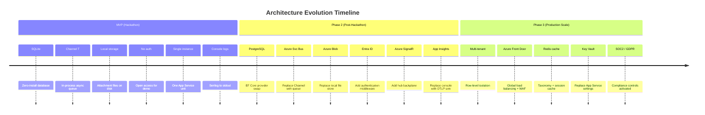

# Section 20 — Final Architecture Recommendation

---

## Architecture in One Sentence

**A single .NET 10 application hosting seven Semantic Kernel agents coordinated by an Orchestrator, streaming real-time execution events via SignalR to a React + React Flow frontend, persisting all agent reasoning chains and human decisions in SQLite, and deployable to Azure App Service with a single command.**

---

## Recommended Architecture Summary

After evaluating the hackathon constraints, technical requirements, judging criteria, and delivery risks, the following architecture is recommended as the optimal balance of speed, demonstrability, and technical depth.

### Backend Recommendation

| Dimension | Recommendation | Rationale |
|-----------|---------------|-----------|
| Runtime | .NET 10 + ASP.NET Core Minimal APIs | Specified constraint; native SignalR; fastest startup time |
| Agent Framework | Semantic Kernel (pinned version) | Microsoft ecosystem alignment; KernelFunction model fits our agent contract pattern |
| LLM Provider | Azure OpenAI (GPT-4o) | Required for hackathon; production-grade API; JSON structured output support |
| Persistence | EF Core 9 + SQLite | Zero infrastructure; demo-sufficient; clean migration path to PostgreSQL |
| Async Queue | Channel<T> + IHostedService | No infrastructure dependency; sufficient for single-instance demo |
| Architecture Pattern | Clean Architecture (4 projects) | Enforced boundaries; testability; independent agent interface/implementation |
| Primary Key | ULID | Sortable, globally unique, no sequence dependency |
| Prompt Management | .prompty files in Infrastructure/Prompts/ | Iterable without recompile; version-controlled; SK-native format |

### Frontend Recommendation

| Dimension | Recommendation | Rationale |
|-----------|---------------|-----------|
| Framework | React 18 + TypeScript + Vite | Specified constraint; fast HMR; excellent ecosystem |
| UI Components | shadcn/ui + Tailwind CSS | Specified constraint; accessible; zero custom CSS overhead |
| Graph Visualization | React Flow (@xyflow/react) | Specified constraint; custom nodes; animated edges; React-native |
| Server State | React Query (TanStack v5) | Best-in-class; automatic caching; mutation support; minimal boilerplate |
| Client State | Zustand | Lightweight; no boilerplate; perfect for real-time event accumulation |
| Real-Time | @microsoft/signalr + React Context | Official client; automatic reconnection; group-based subscriptions |
| Organization | Feature-based folders | Navigable; self-contained features; scales to team |

### Infrastructure Recommendation

| Dimension | Recommendation | Rationale |
|-----------|---------------|-----------|
| Hosting | Azure App Service (B2) | Specified constraint; WebSocket supported; HTTPS by default; simple deployment |
| Deployment | Single deployable unit (API + SPA static files) | Simplest deployment; no separate frontend hosting needed |
| Secrets | dotnet user-secrets (dev) + App Service settings (prod) | No Azure Key Vault setup required for hackathon |
| Monitoring | Serilog console + file sinks (MVP) | Zero infrastructure; sufficient for demo observation |
| Docker | docker-compose.yml for containerized local option | Enables demo from any machine without .NET SDK installed |

---

## Why This Architecture Wins the Hackathon

### 1. It Directly Answers Every Judging Criterion

| Criterion | How the Architecture Satisfies It |
|-----------|----------------------------------|
| Multi-agent collaboration | 7 agents with defined responsibilities, coordinated by Orchestrator, producing a unified outcome |
| Multi-step reasoning | The agent execution chain (Classification → DocUnderstanding → Specialist → Taxonomy/Human) is a literal multi-step reasoning chain |
| Agent orchestration | Orchestrator Agent owns the state machine, conflict detection, agent selection, and outcome consolidation |
| Human-in-the-loop | Human Collaboration Agent is architecturally peer to AI agents; human decisions flow through the same execution record system |
| Explainable AI | `ReasoningText` and `ConfidenceScore` are mandatory agent output fields; reasoning chain is the primary UI view |
| Dynamic taxonomy evolution | Taxonomy is a runtime data model; the Taxonomy Evolution Agent can extend it without deployment |

### 2. It Prioritizes Demonstrability Without Sacrificing Depth

The architecture is not a demo-specific shortcut — it is a real system with real architectural depth (Clean Architecture, domain events, agent contracts, audit trail) that happens to be demonstrable in 5 minutes.

Every architectural choice that adds complexity without adding demo value has been deferred with a documented migration path. Every choice that adds demo value without compromising future maintainability has been kept.

### 3. It Is Deliverable in 4 Sprints

The stub-first development approach in Sprint 0 means the frontend, SignalR, and React Flow graph work from day one with simulated agent data. Real LLM integration replaces stubs incrementally across Sprints 1 and 2. The team always has a running, demonstrable artifact — never a broken mid-construction system.

### 4. It Is Maintainable Post-Hackathon

The Clean Architecture investment in Sprint 0 pays dividends immediately:
- Each agent can be unit-tested independently without LLM calls (stub the interface)
- Adding a new agent type requires only adding a class in Infrastructure and registering it in DI
- Switching from SQLite to PostgreSQL is a configuration change
- Adding authentication is a middleware change — no business logic modification

---

## What to Build First on Monday Morning

If this SAD is handed to a development team with the mandate to start immediately, the recommended first-morning actions are:

1. **Create the .NET solution** with the four project structure — this is the foundation everything else builds on
2. **Define all domain entities** as C# records — this encodes the product design into compilable contracts
3. **Write the EF Core `AppDbContext`** with all entity configurations and run the initial migration — the database should be created by end of Day 1
4. **Implement stub agent classes** that return hardcoded results — by Day 2, the pipeline executes without any LLM calls
5. **Create the React project** with the AppShell and routing — by Day 2, the frontend navigates without errors
6. **Wire SignalR** — by Day 3, a stub agent completion event appears in the browser developer console

This sequence ensures the team is **integration-testing the full stack from Day 3**, not discovering integration issues in Sprint 2.

---

## Migration Roadmap Summary

---

## Final Recommendation

**Build exactly what is specified in this document. Nothing more, nothing less.**

The architecture described here is:
- **Simple enough** to deliver in 4 sprints with a small team
- **Real enough** to demonstrate genuine technical depth to judges
- **Extensible enough** to grow into a production enterprise platform after the hackathon
- **Aligned enough** with the Microsoft Agents League Reasoning Agents category to win

The greatest risk is not technical — it is scope creep and over-engineering. The agent graph visualization, the real-time SignalR stream, the taxonomy evolution loop, and the human collaboration flow are the four moments that will win the hackathon. Invest disproportionately in making those four moments visually compelling, reliable, and narratively clear.

Everything else is scaffolding.

---

## Document Revision History

| Version | Date | Author | Changes |
|---------|------|--------|---------|
| 1.0 | 2026-06-14 | Architecture Team | Initial release — complete SAD for MVP |
