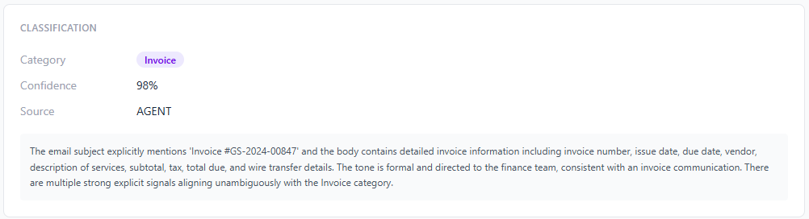
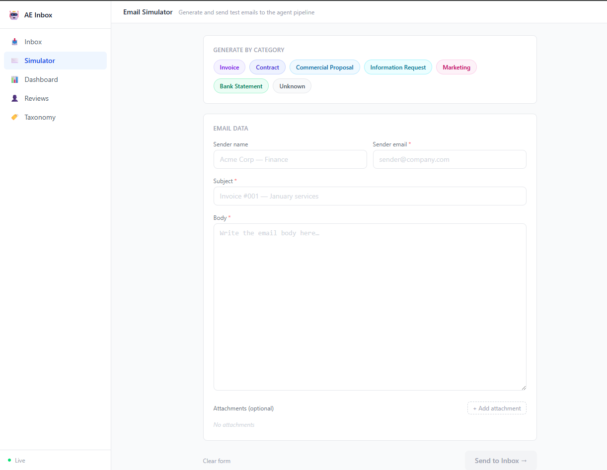

# User Guide — Agentic Enterprise Inbox

This guide walks operators and reviewers through every screen of the system, explaining what each section shows and what actions are available.

---

## Navigation

The left sidebar is always visible and contains five sections:

| Icon | Section | Purpose |
|------|---------|---------|
| Inbox | [Inbox](#inbox) | List of all incoming emails and their processing status |
| Simulator | [Simulator](#simulator) | Send test emails directly into the agent pipeline |
| Dashboard | [Dashboard](#dashboard) | Real-time metrics and processing statistics |
| Reviews | [Human Review Queue](#human-review-queue) | Emails waiting for a human decision |
| Taxonomy | Taxonomy | Category proposals suggested by the Taxonomy Evolution Agent |

A **Live** indicator at the bottom of the sidebar shows whether the real-time SignalR connection is active.

---

## Dashboard

The Dashboard is the operations center. It gives a live view of processing health.


### KPI cards (top row)

| Card | What it shows |
|------|---------------|
| **Total Emails** | All emails ever ingested into the system |
| **Automation Rate** | Percentage processed end-to-end without human intervention |
| **Pending Reviews** | Emails currently waiting in the Human Review Queue |
| **Taxonomy Proposals** | New category suggestions awaiting approval |

### Email Status Breakdown

A horizontal bar chart showing the count of emails in each state:

| Status | Meaning |
|--------|---------|
| **Completed (Auto)** | Processed fully by agents — no human needed |
| **Completed (Human)** | Completed after a human approved or corrected the classification |
| **Awaiting Review** | Routed to the Human Review Queue, pending decision |
| **Processing** | Currently running through the agent pipeline |
| **Failed** | Pipeline encountered an unrecoverable error |

### 7-Day Throughput

A bar chart comparing **Ingested** (light blue) vs **Completed** (dark blue) emails per day. Use this to spot backlogs or drops in throughput.

### Category Distribution

Shows how the email volume is distributed across business categories — Invoice, Bank Statement, Contract, Commercial Proposal, Information Request, Marketing, etc.

### Confidence Distribution

Shows the average agent confidence across all processed emails and splits it into:

- **High ≥ 85%** — auto-processed without escalation
- **Medium 70–84%** — may be routed to human review depending on configuration
- **Low < 70%** — always escalated

A healthy system shows ≥ 90% of emails in the High band.

---

## Inbox

The Inbox lists every email the system has received, newest first.


### Columns

| Column | Description |
|--------|-------------|
| **Sender** | Name and email address of the sender |
| **Subject** | Email subject line (truncated) |
| **Status** | Current processing status badge |
| **Category** | Business category assigned by the Classification Agent |
| **Received** | Date and time the email arrived |
| **Att.** | Number of attachments |

### Status badges

| Badge | Color | Meaning |
|-------|-------|---------|
| COMPLETED HUMAN | Green | Pipeline complete; a human was involved in the decision |
| COMPLETED | Green | Pipeline complete; fully automated |
| AWAITING REVIEW | Amber | Waiting for a human decision in the Review Queue |
| PROCESSING | Blue | Agents are currently working on this email |
| FAILED | Red | An error stopped the pipeline |

Click any row to open the **Email Detail** view.

### Filtering

Use the **All statuses** dropdown (top right) to filter the list by a specific status.

---

## Email Detail

Clicking an email opens a full detail page showing everything the agents did.


### Header

Shows the email subject, sender name and address, received timestamp, status badge, and category badge. If the email was human-reviewed or had an agent conflict detected, a note appears below the timestamps.

### Workflow Status Card

A summary row with four fields:

| Field | Description |
|-------|-------------|
| **Status** | Current workflow state |
| **Routed to** | Which agent or review step the Orchestrator selected |
| **Routing reason** | The Orchestrator's explanation for its routing decision |
| **Summary** | Final outcome sentence produced by the pipeline |

Start and completion timestamps appear in the bottom-right corner.

### Workflow Graph / Reasoning Timeline tabs

A tabbed panel presenting two complementary views of the same pipeline run.

**Workflow Graph** tab (default):

A visual node graph showing the exact path the email took through the agent workforce. Each node displays:
- Agent name
- Category or routing label
- Confidence bar (for classification nodes)
- Status dot: green = completed, blue = running, red = failed

Example path for a human-reviewed invoice:

```
Email
  ↓
Classification Agent — Invoice · 98% conf
  ↓
Orchestrator Agent — → Invoice Agent
  ↓
Human Review — Approved
  ↓
Invoice Agent — 100% conf
```

**Reasoning Timeline** tab:

A chronological list of every event in the pipeline, in the order it happened. Each entry shows the agent name, its full reasoning text, confidence badge, and status tag.


Event types that appear in the timeline:

| Event | Who produces it | Description |
|-------|----------------|-------------|
| `*Agent Completed` | Classification / Orchestrator / Invoice / Contract Agent | Agent finished and produced output |
| `Review Requested — CLASSIFICATION_REVIEW` | Human-Collaboration-Agent | Escalation to the human queue was triggered |
| `Review Decided — APPROVE` | human-reviewer | A human submitted a decision |

The timeline is the best tool for auditing why the pipeline took a specific path or understanding what each agent was thinking at each step.

### Agent Activity

A panel listing each agent execution with its elapsed time, result category, and a full-width confidence bar.


Each card shows:

- **Agent name** and completion time in seconds
- **Category** output (for Classification Agent) or summary sentence (for specialized agents)
- **Confidence bar** — green ≥ 80%, amber ≥ 50%, red < 50%
- **Reasoning text** — the agent's explanation for its output

This section is useful for timing analysis (e.g. which agent is slowest) and for verifying that each agent's output is consistent with the final result.

### Document Understanding

Shows how the system's knowledge of the document evolved across pipeline phases.


The four phases are displayed as a horizontal progression. The **Current** badge marks the most recently reached phase:

| Phase | Who updates it | What it holds |
|-------|---------------|---------------|
| **Initial (Classification)** | Classification Agent | First category guess and confidence |
| **Refined (Specialized)** | Invoice / Contract Agent | Updated category and extracted summary after deep analysis |
| **Suggested (Taxonomy)** | Taxonomy Evolution Agent | A proposed new or refined category (if triggered) |
| **Approved (Human)** | Human reviewer | Confirmed final category after human decision |

Below the phase cards, the **Current Understanding** block shows the active category, confidence, and the specialized agent's extracted summary in plain text. This is the canonical output the system would hand to a downstream business process.

The **Agent Conflicts** section immediately below shows whether any two agents disagreed during processing. If no conflicts were detected, it displays "No agent conflicts detected for this workflow."

The **Invoice Analysis** (or **Contract Analysis**) section at the bottom shows the structured data extracted by the specialized agent — supplier, invoice number, dates, amounts — along with the overall confidence score.

### Classification

The raw output from the Classification Agent for this email.



| Field | Description |
|-------|-------------|
| **Category** | Business category assigned |
| **Confidence** | Agent's confidence score (0–100%) |
| **Source** | `AGENT` = autonomous; `HUMAN` = manually overridden |

The reasoning block below the fields shows the agent's full explanation — every signal it used to reach its conclusion.

---

## Simulator

The Simulator lets you inject test emails directly into the agent pipeline without needing a real email server.



### Generate by category

Click one of the category buttons to instantly fill the form with a realistic sample email for that type:

- **Invoice** — Accounts payable with invoice number, amounts, due date
- **Contract** — Legal agreement with parties, dates, clauses
- **Commercial Proposal** — Sales proposal with pricing and terms
- **Information Request** — Customer inquiry or case follow-up
- **Marketing** — Promotional or event email
- **Bank Statement** — Financial account statement
- **Unknown** — Ambiguous content to test low-confidence handling

### Form fields

| Field | Required | Description |
|-------|----------|-------------|
| Sender name | No | Display name of the simulated sender |
| Sender email | Yes | From address (any valid email format) |
| Subject | Yes | Email subject line |
| Body | Yes | Full email body text |
| Attachments | No | Upload one or more files to simulate attachments |

### Sending

Click **Send to Inbox →** to submit the email. The system immediately ingests it and starts the agent pipeline. Navigate to the Inbox to watch the status update in real time, or open the email detail to see the Workflow Graph animate as each agent completes.

Click **Clear form** to reset all fields.

---

## Human Review Queue

When the Orchestrator Agent routes an email to Human Review, it appears here.


The badge on the **Reviews** sidebar item shows the number of pending items.

### Review card

Each card shows:

| Field | Description |
|-------|-------------|
| **Priority** | `NORMAL`, `HIGH`, or `URGENT` — set by the Human Collaboration Agent |
| **Type** | `CLASSIFICATION_REVIEW` (verify category), or `CONFLICT_RESOLUTION` (agents disagreed) |
| **Date** | When the review was requested |
| **Confidence** | The agent's confidence at the time of escalation |
| **Recommendation** | The agent's suggested decision and rationale |

### Making a decision

Click **Make a decision** to open the review dialog. Options vary by review type:

**Classification Review**
- **Approve** — confirm the agent's category; the pipeline resumes with the specialized agent
- **Approve with corrections** — confirm but override the category before resuming
- **Reject** — reject the classification; the email is marked for reprocessing

After approval the pipeline resumes automatically: the appropriate specialized agent (Invoice Agent, Contract Agent, etc.) runs and the email status updates to **Completed (Human)**.

---

## Real-time updates

All screens update live via SignalR — no manual refresh needed. When an agent completes or a workflow changes state, the Inbox list, Dashboard counters, and Email Detail graph all update automatically within seconds.

The **Live** indicator in the sidebar bottom-left confirms the connection is active. If it disappears, the UI will reconnect automatically and resume receiving updates.
